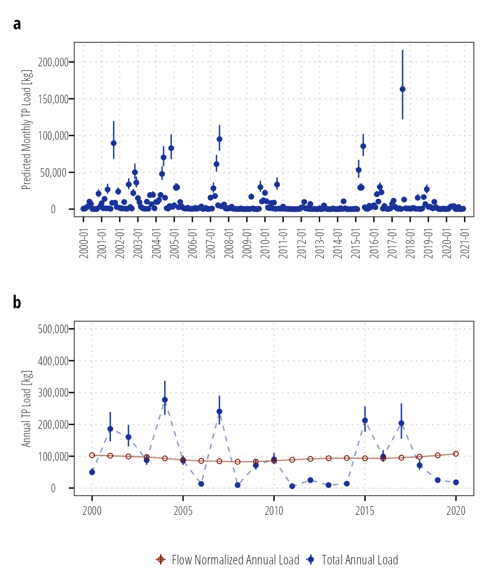
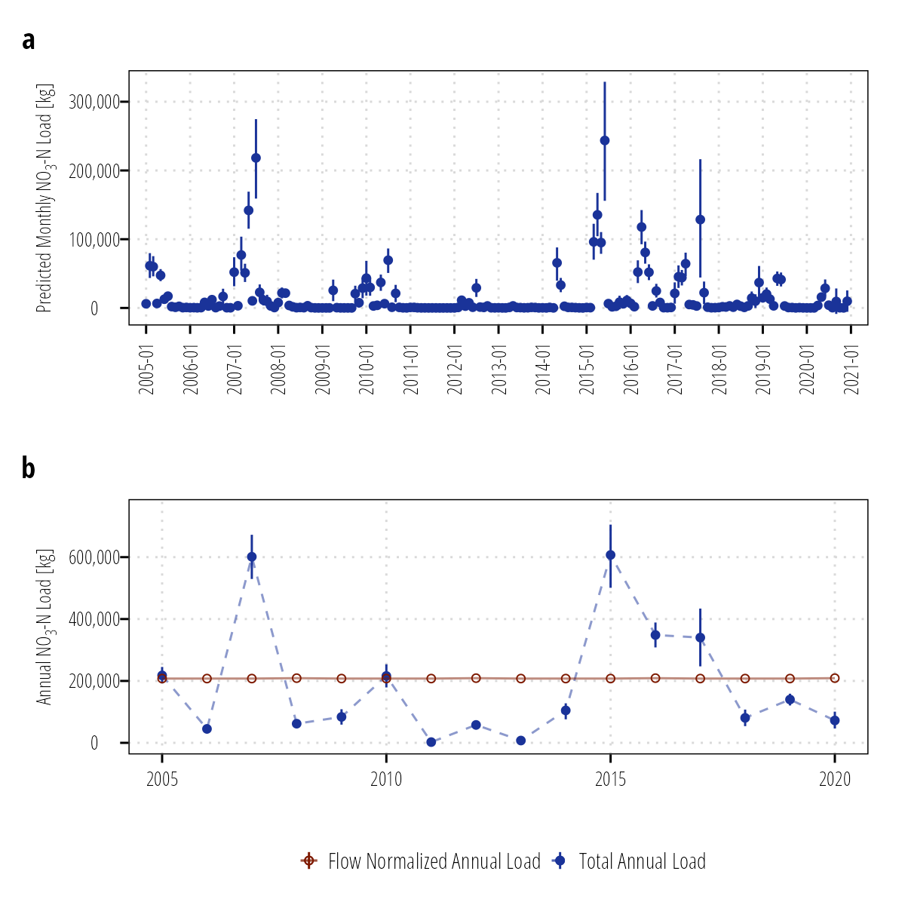
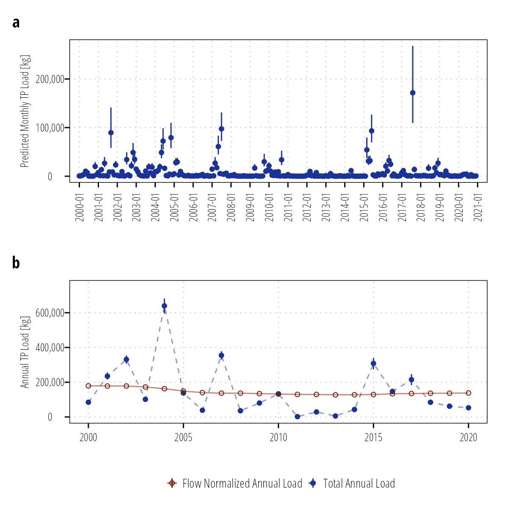
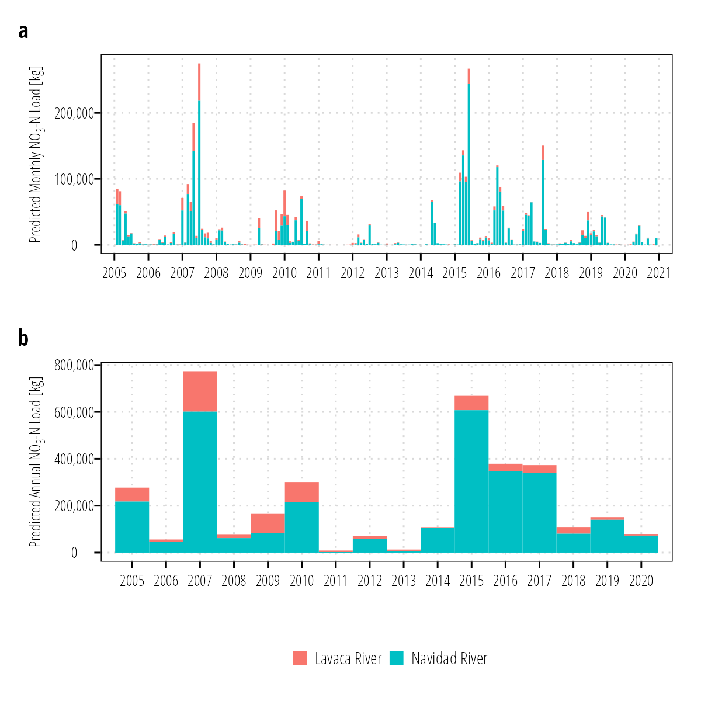
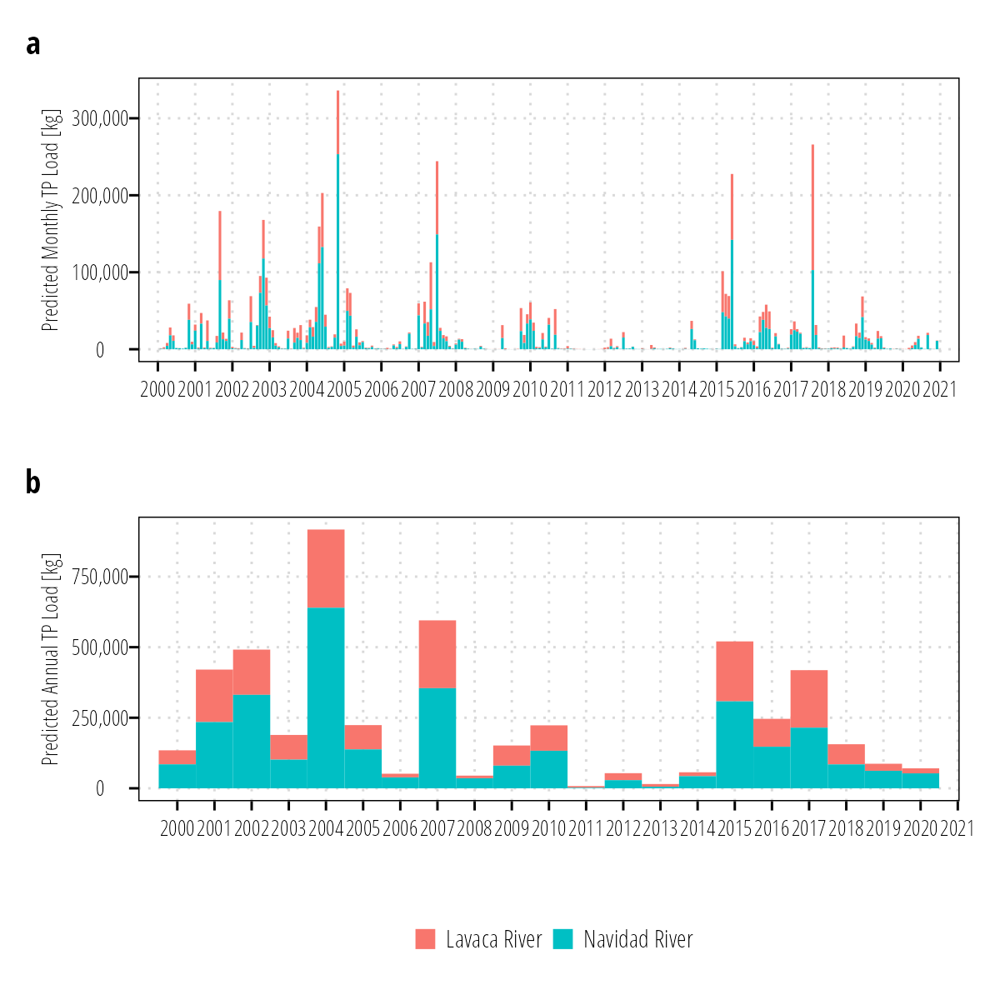

::: {.cell}

:::

# Load estimation and summarization

Daily Nitrate-Nitrogen (NO~3~-N) and Total Phosphorus (TP) loads at stream sites were predicted using fitted GAM models. Standard deviations and credible intervals from GAM models can be obtained by drawing samples from the multivariate normal posterior distribution of the fitted GAM [@woodCONFIDENCEINTERVALSGENERALIZED2006; @marraCoveragePropertiesConfidence2012; @mcdowellImplicationsLagTimes2021]. Uncertainty in loads were reported as 95% credible intervals developed by drawing 1000 realizations of parameter estimates from the multivariate normal posterior distribution of the model parameters. We re-estimated the load for each realization and report the 2.5% and 97.5% quantiles. Monthly and annual loads were calculated by summing for each respective time period. 

Daily flow variability is responsible for the majority of daily load variability. WRTDS utilizes a flow- normalization procedure that removes the influence of flow variability by treating daily flow as a random sample of all possible discharges on a given day [@hirschWeightedRegressionsTime2010]. The flow-normalized estimates are not true estimates of load, but are indicative of potential changes in load that are not attributable to variability in daily flow. These flow-normalized estimates are most suitable for assessing changes in long-term trends. We implemented a similar procedure by setting flow-based covariates on each day of the year equal to each of the historical values for that day of the year between 2000 and 2021. The flow-normalized estimate is simply the mean of the model predictions for each day considering all of the flow values. Flow-normalized estimates and credible intervals were aggregated to annual reporting periods following procedures used for predicted actual loading.

# Total Load Estimates

## Lavaca River at Edna, USGS-08164000

::: {.cell}
::: {.cell-output-display}

:::
:::

::: {.cell}
::: {.cell-output-display}

:::
:::

\clearpage

## Navidad River at Palmetto Bend Dam, Lake Texana

::: {.cell}
::: {.cell-output-display}

:::
:::

::: {.cell}
::: {.cell-output-display}

:::
:::

\clearpage

## Total Export

### NO~3~-N

::: {.cell}
::: {.cell-output-display}

:::
:::

\clearpage

### TP

::: {.cell}
::: {.cell-output-display}

:::
:::

\clearpage

# References
