# Modeling Approach

Site-specific Generalized Additive Models (GAMs) were developed for Nitrate-Nitrogen (NO~3~-N) and Total Phosphorus (TP). Previous papers suggest that other regression based load estimators, namely Weighted Regressions on Time Discharge and Season (WRTDS) produce results similar to GAMs where flow and season are primary drivers in nutrient loads [@beckNumericalQualitativeContrasts2017]. However, the mgcv package used to implement GAMs are easily extended to additional predictor variables and therefore chosen to be applied here [@beckNumericalQualitativeContrasts2017; @robsonPredictionSedimentParticulate2015a; @kuhnertQuantifyingTotalSuspended2012]. 

A suite of potential flow-based predictor variables were developed based on [@zhangImprovingRiverineConstituent2017].

$$
Y = s(ddate) + s(yday) + s(log1p(Q)) + s(stfa) + s(ma)
$$

where $Y$ is the response variable that is a function of the sum of some smoothed predictor variables. For each of the stream sites the response variable is daily NO~3~-N or TP load in kg/day. 

 - $ddate$ is date converted to decimal format;
 - $yday$ is the day of the year as a numeral between 1 and 366;
 - $log1p(Q)$ is mean daily streamflow plus one, log transformed;
 - $stfa$ is a short-term flow anomaly, a unitless term that reflects the difference in the current discharge from flows in the previous month;
 - $ma$ is the exponentially smoothed flow which is used to incorporate the influence of past flows on current load or concentration estimates;

The model was slightly altered for the Lake Texana site where daily load measurements are not a function of natural flow processes, but of operation decisions. Here, we expect concentration and load discharged from the dam to vary as a function of tributary inputs and some unknown lake metabolism processes. At this location, daily concentrations were modeled as a function of total inflow to the lake. Each of the flow based covariates ($log1p(Q)$, $stfa$, and $ma$) were calculated based on total inflow from gaged tributaries. Mean daily discharge was also included as a covariate under the assumption that hydraulic dynamics can substantially vary near the outlet of the dam based on the amount of water being discharged and influence nutrient concentration. Even under high inflow conditions, discharge might be low if it has been dry, conversely discharge could be higher than inflows if lake levels are high. Total loads below Palmetto Bend Dam were estimated using nutrient concentration in Lake Texana and reported mean daily dam discharges.

Thin plate regression splines were used for $ddate$, $log1p(Q)$, $ltfa$, and $ma$. A cyclic cubic regression spline was used for $yday$ to ensure ends of the spline match (day 1 and day 366 should match). First-order penalties were applied to the smooths of flow-based variables which penalize departures from a flat function to help constrain extrapolations for high flow measurements. GAMs were fit using the `gam()` function in the "mgcv" package in R version 4.2.1. Basis dimensions used for smooths were adjusted after using the `gam.check()` function to ensure models were not oversmoothed. Model residuals were inspected for distributional assumptions using the "gratia" package.

Left-censored nutrient concentrations were not uncommon in this dataset. Several methods are available to account for censored data. We decided to transform left-censored data to one-half the detection limit based on the fact that higher concentrations and loadings are typically associated with high-flow events and low-flow/low-concentration events will account for a small proportion of total loadings [@mcdowellImplicationsLagTimes2021]. The "cenGAM" package in R provides the Tobit I family to accommodate censored data using the "gam" function in R. Censored Gamma models can be fit using a Bayesian framework with the "brms" package in R. Initial exploration using "cenGAM" and "brms" packages resulted in models that overestimated nutrient concentrations relative to "mgcv" [@bergbuschUnexpectedShiftPhytoplankton2021]. All models were fit using the Gamma family and log link function.

Hold-out data is often used to validate predictive ability of a model. Given the small-sample size, we used all the available data to fit models at each site and implemented repeated 5-fold cross validation to assess model performance. Cross-validation predictions were assessed using Nash-Sutcliffe Efficiency (NSE), R^2^, and Percent Bias across all folds.

# Model Results

## Lavaca River at Edna, 08164000 

::: {.cell}

:::

### NO~3~-N

::: {.cell-output-display}
\begin{widestuff}

\caption{\label{tab:tbl-no3_08164000}NO\textsubscript{3}-N GAM summary - Lavaca River at Edna, USGS-08164000.}
\centering
\begin{tabular}[t]{llllllrll}
\toprule
Component & Term & Estimate & Std.Error & t-value & edf & ref.df & F-value & p-value\textsuperscript{1}\\
\midrule
A. parametric coefficients & (Intercept) & -2.349 & 0.150 & -15.679 &  &  &  & 0.000 ***\\
\cmidrule{1-9}
 & s(ddate) &  &  &  & 6.475 & 17 & 2.494 & 0.000 ***\\

 & s(yday) &  &  &  & 2.234 & 8 & 2.601 & 0.000 ***\\

 & s(log1p(Flow)) &  &  &  & 6.256 & 9 & 5.079 & 0.000 ***\\

 & s(ma) &  &  &  & 1.851 & 5 & 0.764 & 0.017 *\\

\multirow[t]{-5}{*}{\raggedright\arraybackslash B. smooth terms} & s(stfa) &  &  &  & 4.630 & 5 & 10.577 & 0.000 ***\\
\bottomrule
\multicolumn{9}{l}{\textsuperscript{1} Signif. codes: 0 <= '***' < 0.001 < '**' < 0.01 < '*' < 0.05 < '+' < 0.1}\\
\multicolumn{9}{l}{\textsuperscript{} Adjusted R-squared: 0.831, Deviance explained 0.881}\\
\multicolumn{9}{l}{\textsuperscript{} -REML : -31.859, Scale est: 0.00988, N: 74}\\
\end{tabular}
\end{widestuff}
:::

::: {#tbl-NO308164000-CV .cell tbl-cap='Summary of goodness-of-fit metrics for 5-fold cross-validation of NO~3~-N GAM at Lavaca River at Edna, USGS-08164000.'}
::: {.cell-output-display}
|**Goodness of Fit Metric** | **Median (IQR)**  |
|:--------------------------|:-----------------:|
|NSE                        | 0.63 (0.55, 0.72) |
|R^2^                       | 0.72 (0.68, 0.80) |
|Percent Bias               |    9 (-8, 12)     |
:::
:::

\clearpage

::: {.cell}
::: {.cell-output-display}
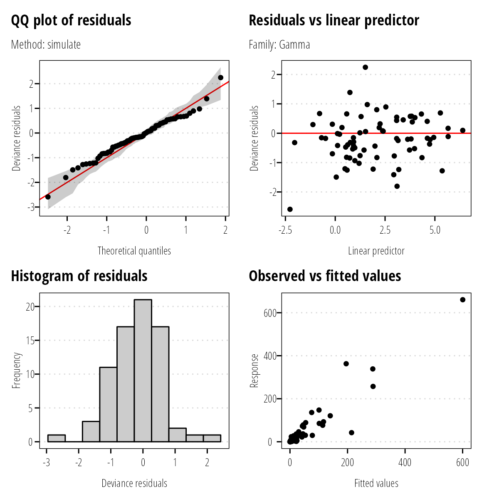
:::
:::

::: {.cell}
::: {.cell-output-display}
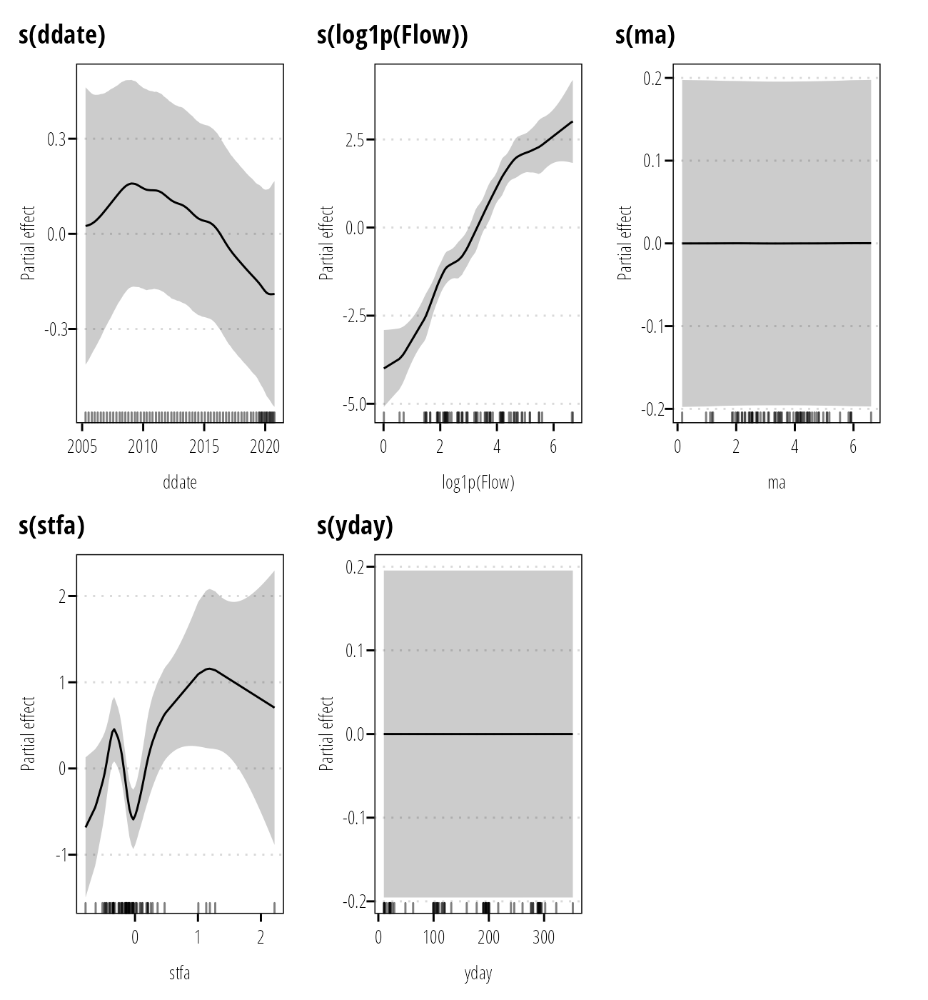
:::
:::

::: {.cell}
::: {.cell-output-display}
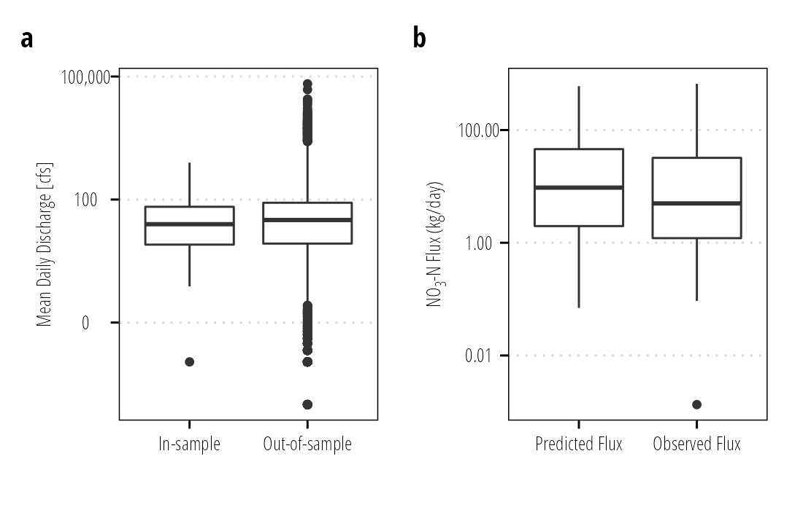
:::
:::

::: {.cell}
::: {.cell-output-display}

:::
:::

\clearpage

### TP

::: {.cell}
::: {.cell-output-display}
\begin{widestuff}

\caption{\label{tab:tbl-tp_308164000}TP GAM summary - Lavaca River at Edna, USGS-08164000.}
\centering
\begin{tabular}[t]{llllllrll}
\toprule
Component & Term & Estimate & Std.Error & t-value & edf & ref.df & F-value & p-value\textsuperscript{1}\\
\midrule
A. parametric coefficients & (Intercept) & -1.611 & 0.045 & -35.811 &  &  &  & 0.000 ***\\
\cmidrule{1-9}
 & s(ddate) &  &  &  & 3.262 & 17 & 0.408 & 0.045 *\\

 & s(yday) &  &  &  & 1.266 & 8 & 0.352 & 0.094 +\\

 & s(log1p(Flow)) &  &  &  & 0.953 & 4 & 0.405 & 0.133\\

 & s(ma) &  &  &  & 0.000 & 5 & 0.000 & 0.510\\

\multirow[t]{-5}{*}{\raggedright\arraybackslash B. smooth terms} & s(stfa) &  &  &  & 2.585 & 4 & 2.857 & 0.003 **\\
\bottomrule
\multicolumn{9}{l}{\textsuperscript{1} Signif. codes: 0 <= '***' < 0.001 < '**' < 0.01 < '*' < 0.05 < '+' < 0.1}\\
\multicolumn{9}{l}{\textsuperscript{} Adjusted R-squared: 0.274, Deviance explained 0.250}\\
\multicolumn{9}{l}{\textsuperscript{} -REML : -70.944, Scale est: 0.162, N: 80}\\
\end{tabular}
\end{widestuff}
:::
:::

::: {#tbl-TP308164000-CV .cell tbl-cap='Summary of goodness-of-fit metrics for 5-fold cross-validation of TP load GAM at Lavaca River at Edna, USGS-08164000.'}
::: {.cell-output-display}
|**Goodness of Fit Metric** |   **Median (IQR)**   |
|:--------------------------|:--------------------:|
|NSE                        |  0.77 (0.71, 0.81)   |
|R^2^                       |  0.77 (0.72, 0.82)   |
|Percent Bias               | -7.45 (-9.10, -6.35) |
:::
:::

\clearpage

::: {.cell}
::: {.cell-output-display}

:::
:::

::: {.cell}
::: {.cell-output-display}
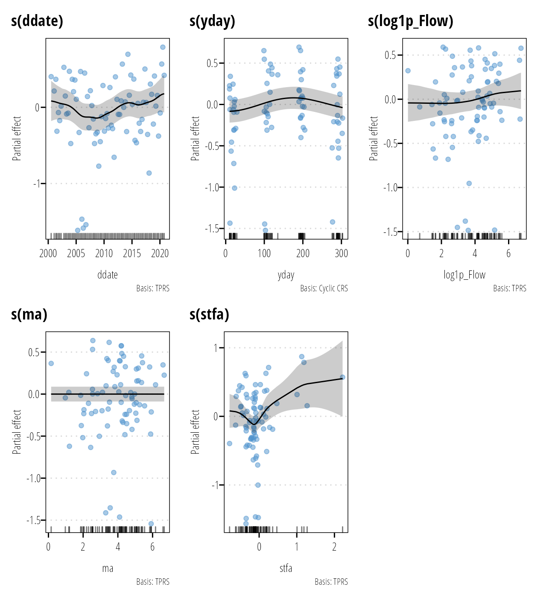
:::
:::

::: {.cell}
::: {.cell-output-display}
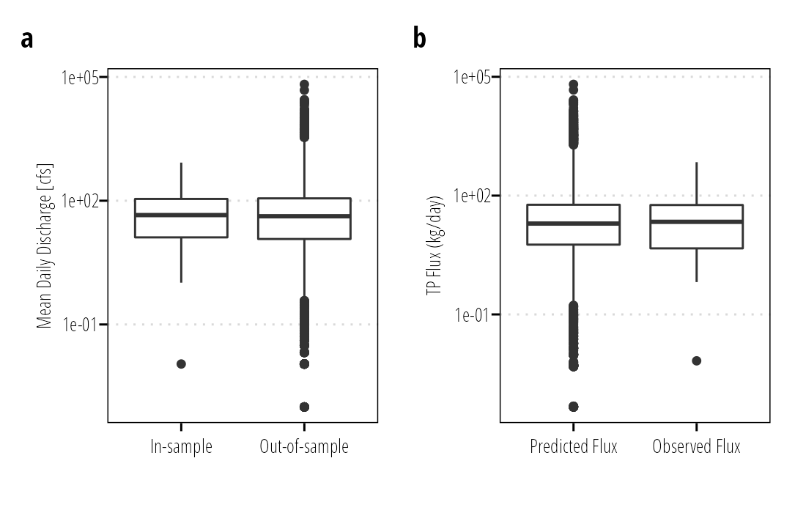
:::
:::

::: {.cell}
::: {.cell-output-display}
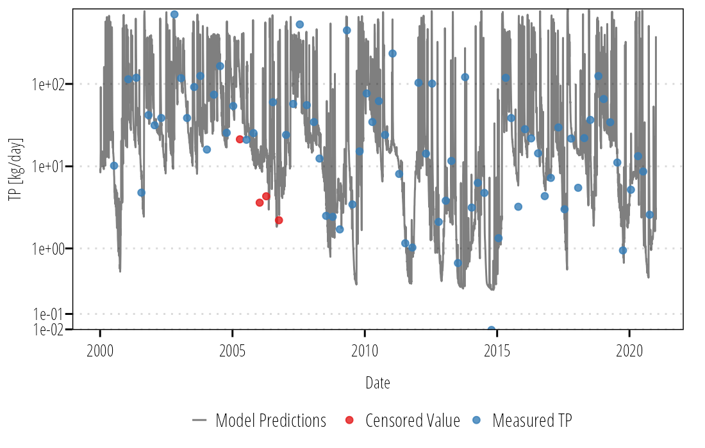
:::
:::

\clearpage

## Navidad River at Strane Pk nr Edna, 08164390

### NO~3~

::: {.cell}
::: {.cell-output-display}
\begin{widestuff}

\caption{\label{tab:tbl-no3_08164390}NO\textsubscript{3}-N GAM summary - Navidad River at Strane Pk nr Edna, USGS-08164390.}
\centering
\begin{tabular}[t]{llllllrll}
\toprule
Component & Term & Estimate & Std.Error & t-value & edf & ref.df & F-value & p-value\textsuperscript{1}\\
\midrule
A. parametric coefficients & (Intercept) & -2.010 & 0.100 & -20.154 &  &  &  & 0.000 ***\\
\cmidrule{1-9}
 & s(ddate) &  &  &  & 1.285 & 17 & 0.704 & 0.001 ***\\

 & s(yday) &  &  &  & 2.541 & 4 & 5.150 & 0.000 ***\\

 & s(log1p(Flow)) &  &  &  & 3.788 & 5 & 4.777 & 0.000 ***\\

 & s(stfa) &  &  &  & 2.992 & 5 & 3.209 & 0.001 ***\\

\multirow[t]{-5}{*}{\raggedright\arraybackslash B. smooth terms} & s(ma) &  &  &  & 0.000 & 4 & 0.000 & 0.308\\
\bottomrule
\multicolumn{9}{l}{\textsuperscript{1} Signif. codes: 0 <= '***' < 0.001 < '**' < 0.01 < '*' < 0.05 < '+' < 0.1}\\
\multicolumn{9}{l}{\textsuperscript{} Adjusted R-squared: 0.720, Deviance explained 0.770}\\
\multicolumn{9}{l}{\textsuperscript{} -REML : -46.798, Scale est: 0.00726, N: 59}\\
\end{tabular}
\end{widestuff}
:::
:::

::: {#tbl-NO308164390-CV .cell tbl-cap='Summary of goodness-of-fit metrics for 5-fold cross-validation of NO~3~-N concentration GAM at Navidad River at Strane Pk nr Edna,, USGS-NO308164390.'}
::: {.cell-output-display}
|**Goodness of Fit Metric** |   **Median (IQR)**   |
|:--------------------------|:--------------------:|
|NSE                        |  0.60 (0.58, 0.65)   |
|R^2^                       |  0.71 (0.65, 0.77)   |
|Percent Bias               | -18.4 (-21.4, -16.5) |
:::
:::

\clearpage

::: {.cell}
::: {.cell-output-display}
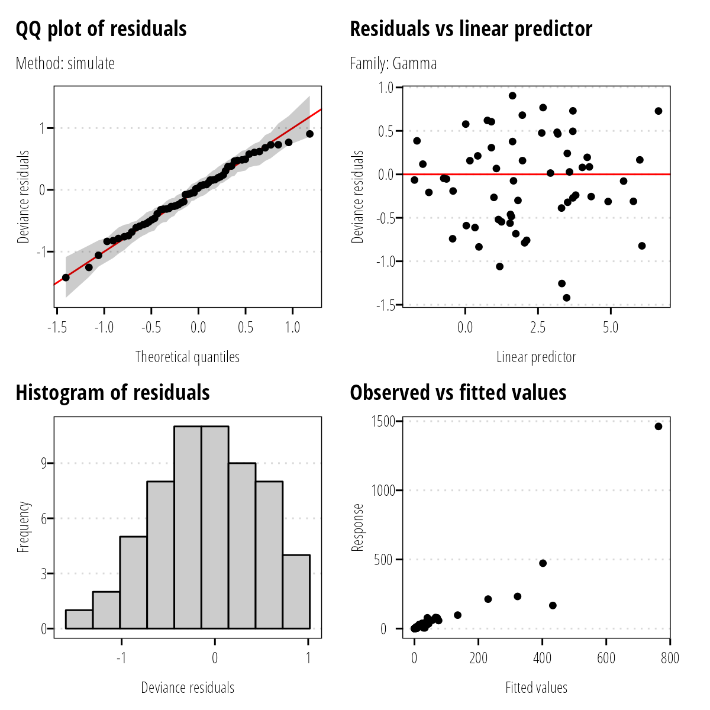
:::
:::

::: {.cell}
::: {.cell-output-display}
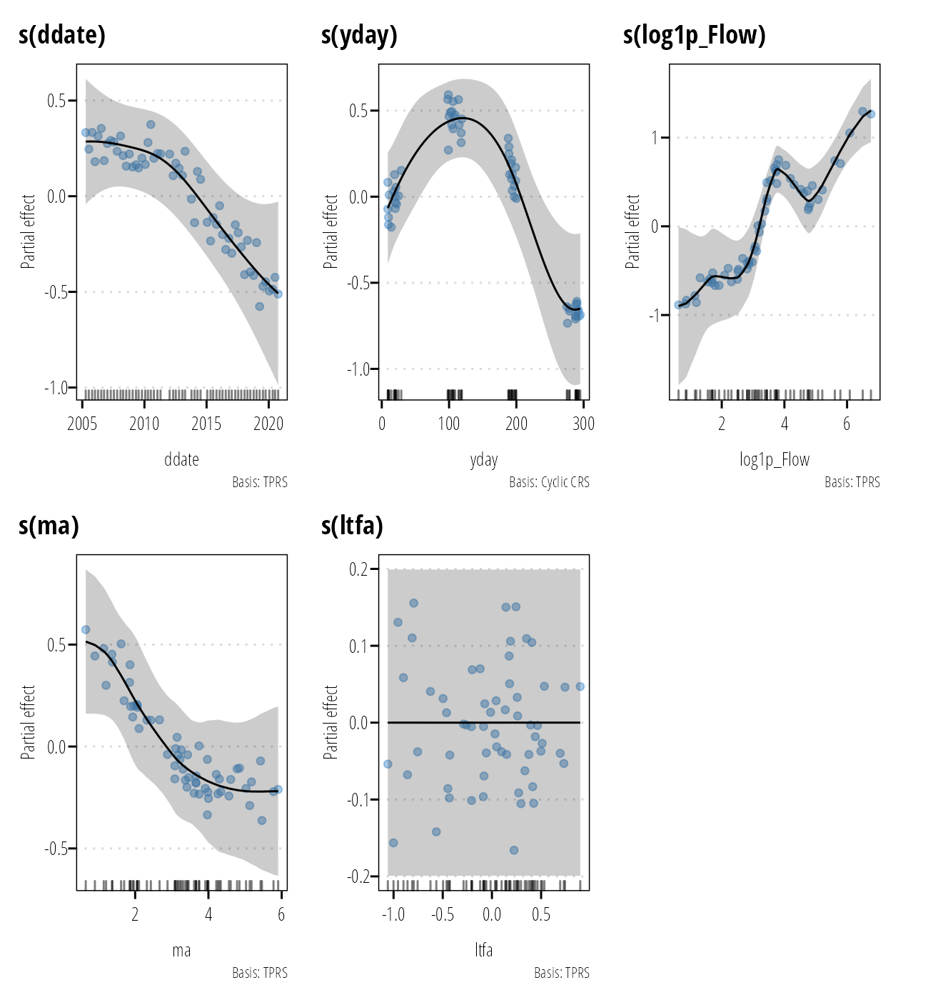
:::
:::

::: {.cell}
::: {.cell-output-display}
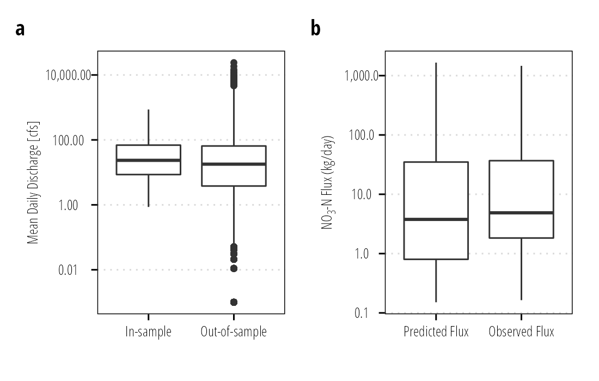
:::
:::

::: {.cell}
::: {.cell-output-display}
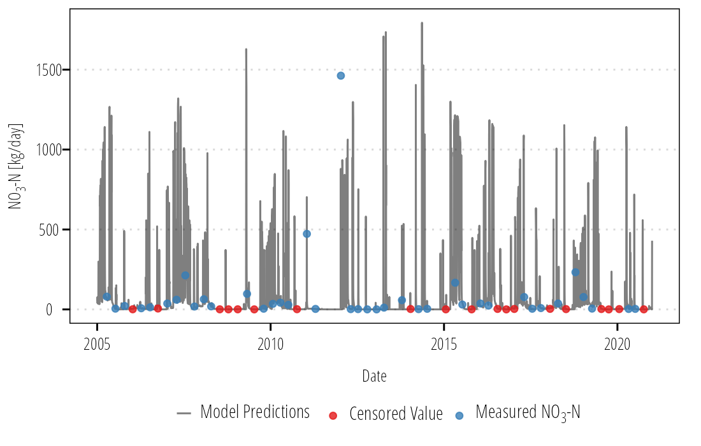
:::
:::

\clearpage

### TP

::: {.cell}
::: {.cell-output-display}
\begin{widestuff}

\caption{\label{tab:tbl-tp_08164390}TP GAM summary - Navidad River at Strane Pk nr Edna, USGS-08164390.}
\centering
\begin{tabular}[t]{llllllrll}
\toprule
Component & Term & Estimate & Std.Error & t-value & edf & ref.df & F-value & p-value\textsuperscript{1}\\
\midrule
A. parametric coefficients & (Intercept) & -1.597 & 0.038 & -42.298 &  &  &  & 0.000 ***\\
\cmidrule{1-9}
 & s(ddate) &  &  &  & 7.120 & 17 & 3.465 & 0.000 ***\\

 & s(yday) &  &  &  & 0.456 & 4 & 0.147 & 0.270\\

 & s(log1p(Flow)) &  &  &  & 2.630 & 5 & 2.428 & 0.002 **\\

 & s(stfa) &  &  &  & 0.000 & 5 & 0.000 & 0.690\\

\multirow[t]{-5}{*}{\raggedright\arraybackslash B. smooth terms} & s(ma) &  &  &  & 0.000 & 5 & 0.000 & 0.759\\
\bottomrule
\multicolumn{9}{l}{\textsuperscript{1} Signif. codes: 0 <= '***' < 0.001 < '**' < 0.01 < '*' < 0.05 < '+' < 0.1}\\
\multicolumn{9}{l}{\textsuperscript{} Adjusted R-squared: 0.550, Deviance explained 0.486}\\
\multicolumn{9}{l}{\textsuperscript{} -REML : -76.491, Scale est: 0.110, N: 77}\\
\end{tabular}
\end{widestuff}
:::
:::

::: {#tbl-TP08164390-CV .cell tbl-cap='Summary of goodness-of-fit metrics for 5-fold cross-validation of TP load GAM at Navidad River at Strane Pk nr Edna, USGS-08164390.'}
::: {.cell-output-display}
|**Goodness of Fit Metric** |   **Median (IQR)**    |
|:--------------------------|:---------------------:|
|NSE                        | 0.951 (0.944, 0.960)  |
|R^2^                       | 0.982 (0.973, 0.984)  |
|Percent Bias               | -9.10 (-10.10, -8.27) |
:::
:::

\clearpage

::: {.cell}
::: {.cell-output-display}
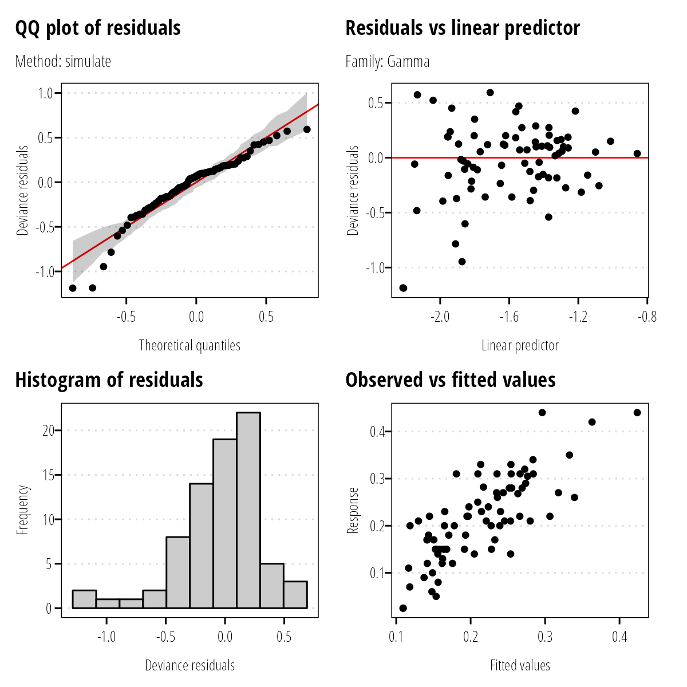
:::
:::

::: {.cell}
::: {.cell-output-display}
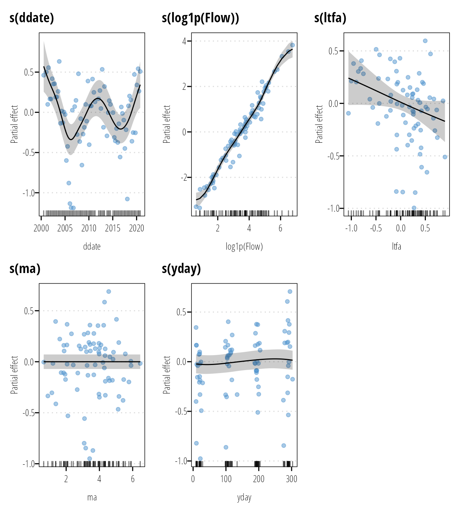
:::
:::

::: {.cell}
::: {.cell-output-display}
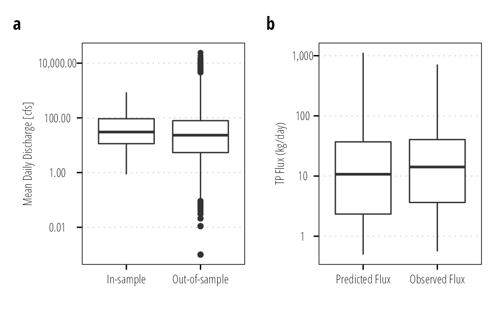
:::
:::

::: {.cell}
::: {.cell-output-display}
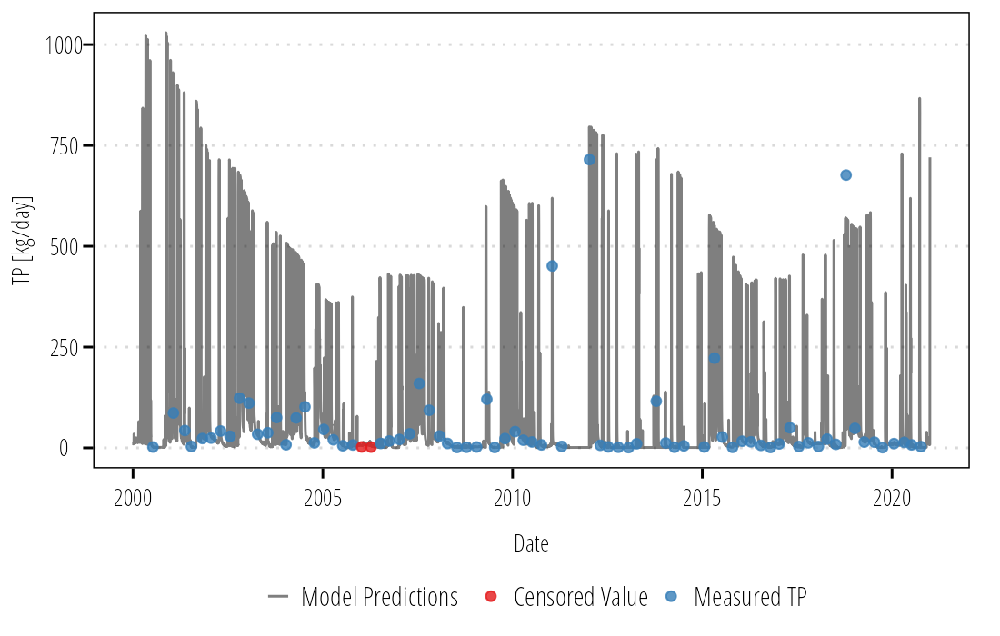
:::
:::

\clearpage

## Sandy Creek nr Ganado, USGS-08164450

### NO~3~

::: {.cell}
::: {.cell-output-display}
\begin{widestuff}

\caption{\label{tab:tbl-no3_08164450}NO\textsubscript{3}-N GAM summary - Sandy Creek nr Ganado, USGS-08164450.}
\centering
\begin{tabular}[t]{llllllrll}
\toprule
Component & Term & Estimate & Std.Error & t-value & edf & ref.df & F-value & p-value\textsuperscript{1}\\
\midrule
A. parametric coefficients & (Intercept) & -1.942 & 0.081 & -24.046 &  &  &  & 0.000 ***\\
\cmidrule{1-9}
 & s(ddate) &  &  &  & 0.000 & 17 & 0.000 & 0.916\\

 & s(yday) &  &  &  & 2.018 & 4 & 2.777 & 0.003 **\\

 & s(log1p(Flow)) &  &  &  & 2.338 & 9 & 0.481 & 0.101\\

 & s(stfa) &  &  &  & 0.000 & 5 & 0.000 & 0.585\\

\multirow[t]{-5}{*}{\raggedright\arraybackslash B. smooth terms} & s(ma) &  &  &  & 4.201 & 5 & 5.113 & 0.000 ***\\
\bottomrule
\multicolumn{9}{l}{\textsuperscript{1} Signif. codes: 0 <= '***' < 0.001 < '**' < 0.01 < '*' < 0.05 < '+' < 0.1}\\
\multicolumn{9}{l}{\textsuperscript{} Adjusted R-squared: 0.261, Deviance explained 0.505}\\
\multicolumn{9}{l}{\textsuperscript{} -REML : -51.428, Scale est: 0.365, N: 56}\\
\end{tabular}
\end{widestuff}
:::
:::

::: {#tbl-NO308164450-CV .cell tbl-cap='Summary of goodness-of-fit metrics for 5-fold cross-validation of NO~3~-N concentration GAM at Sandy Creek nr Ganado, USGS-08164450.'}
::: {.cell-output-display}
|**Goodness of Fit Metric** | **Median (IQR)**  |
|:--------------------------|:-----------------:|
|NSE                        | 0.47 (0.34, 0.50) |
|R^2^                       | 0.49 (0.38, 0.57) |
|Percent Bias               |   -15 (-20, -8)   |
:::
:::

\clearpage

::: {.cell}
::: {.cell-output-display}
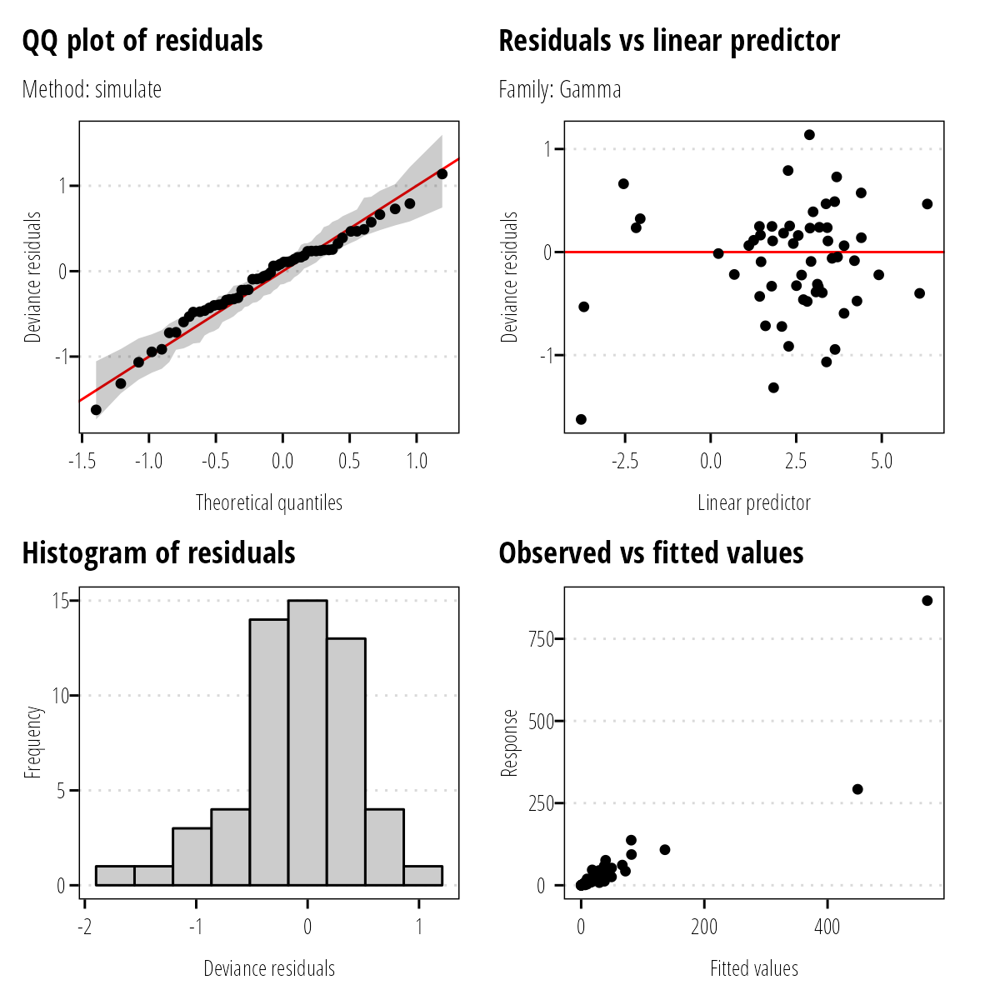
:::
:::

::: {.cell}
::: {.cell-output-display}
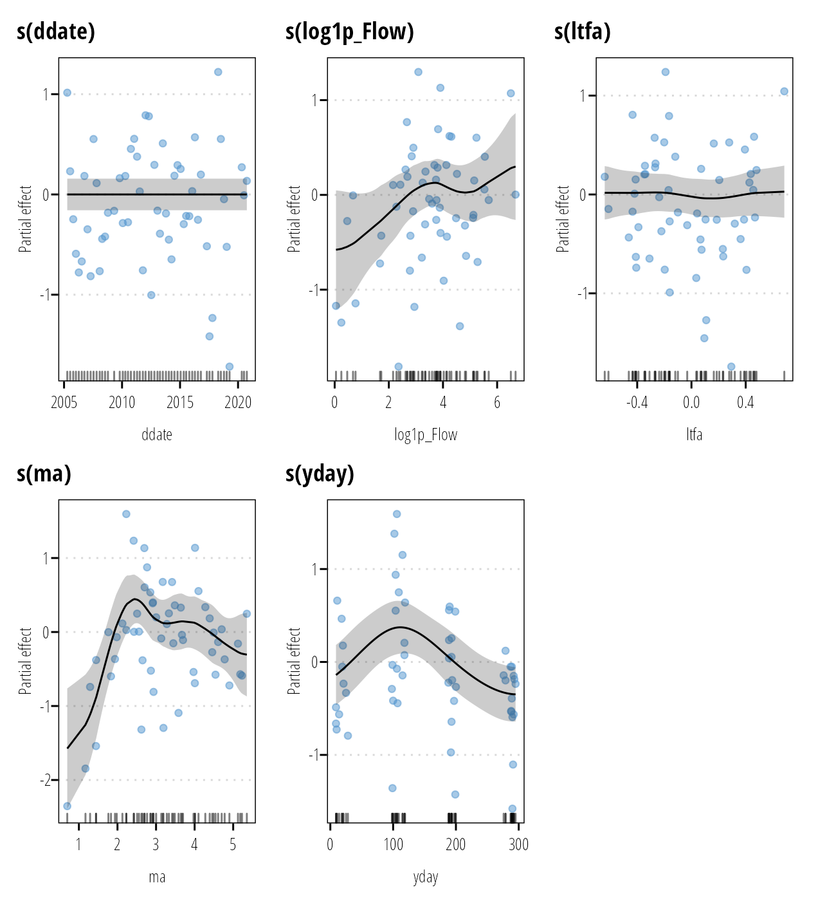
:::
:::

::: {.cell}
::: {.cell-output-display}
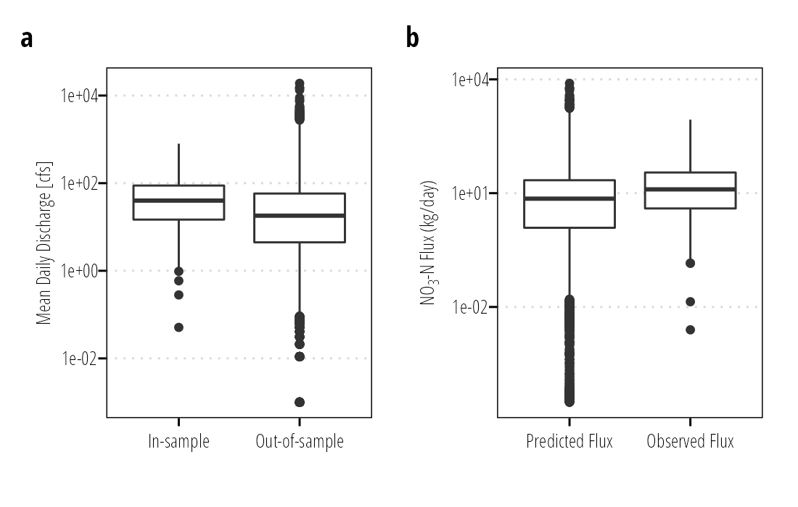
:::
:::

::: {.cell}
::: {.cell-output-display}
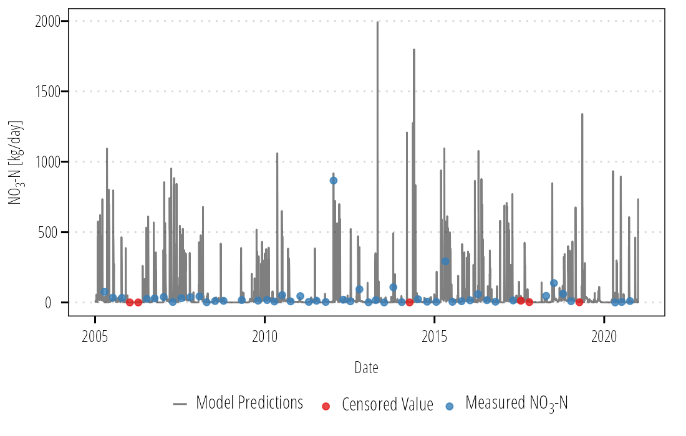
:::
:::

\clearpage

### TP

::: {.cell}
::: {.cell-output-display}
\begin{widestuff}

\caption{\label{tab:tbl-tp_08164450}TP GAM summary - Sandy Creek nr Ganado, USGS-08164450.}
\centering
\begin{tabular}[t]{llllllrll}
\toprule
Component & Term & Estimate & Std.Error & t-value & edf & ref.df & F-value & p-value\textsuperscript{1}\\
\midrule
A. parametric coefficients & (Intercept) & -1.729 & 0.067 & -25.973 &  &  &  & 0.000 ***\\
\cmidrule{1-9}
 & s(ddate) &  &  &  & 9.316 & 17 & 4.295 & 0.000 ***\\

 & s(yday) &  &  &  & 0.000 & 4 & 0.000 & 0.730\\

 & s(log1p(Flow)) &  &  &  & 6.939 & 9 & 2.967 & 0.000 ***\\

 & s(stfa) &  &  &  & 2.097 & 5 & 0.757 & 0.090 +\\

\multirow[t]{-5}{*}{\raggedright\arraybackslash B. smooth terms} & s(ma) &  &  &  & 2.171 & 4 & 3.529 & 0.000 ***\\
\bottomrule
\multicolumn{9}{l}{\textsuperscript{1} Signif. codes: 0 <= '***' < 0.001 < '**' < 0.01 < '*' < 0.05 < '+' < 0.1}\\
\multicolumn{9}{l}{\textsuperscript{} Adjusted R-squared: 0.757, Deviance explained 0.824}\\
\multicolumn{9}{l}{\textsuperscript{} -REML : -34.024, Scale est: 0.00944, N: 75}\\
\end{tabular}
\end{widestuff}
:::
:::

::: {#tbl-TP08164450-CV .cell tbl-cap='Summary of goodness-of-fit metrics for 5-fold cross-validation of TP load GAM at Sandy Creek nr Ganado, USGS-08164450.'}
::: {.cell-output-display}
|**Goodness of Fit Metric** | **Median (IQR)**  |
|:--------------------------|:-----------------:|
|NSE                        | 0.78 (0.56, 0.81) |
|R^2^                       | 0.81 (0.67, 0.86) |
|Percent Bias               |    -6 (-9, -3)    |
:::
:::

\clearpage

::: {.cell}
::: {.cell-output-display}
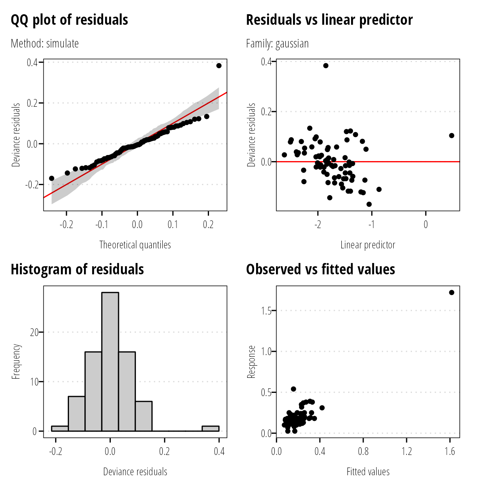
:::
:::

::: {.cell}
::: {.cell-output-display}
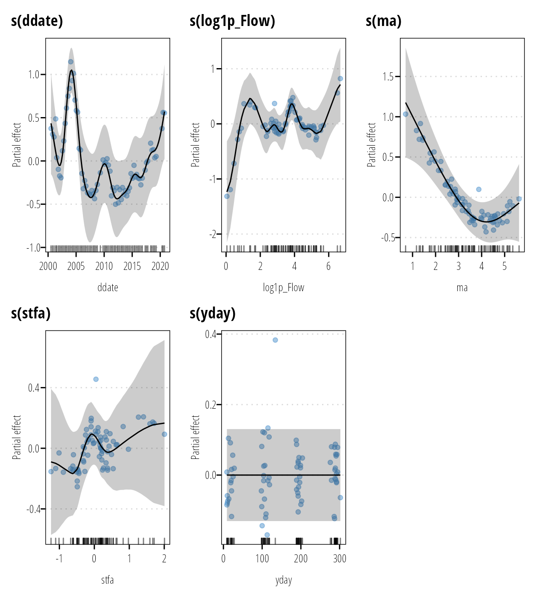
:::
:::

::: {.cell}
::: {.cell-output-display}
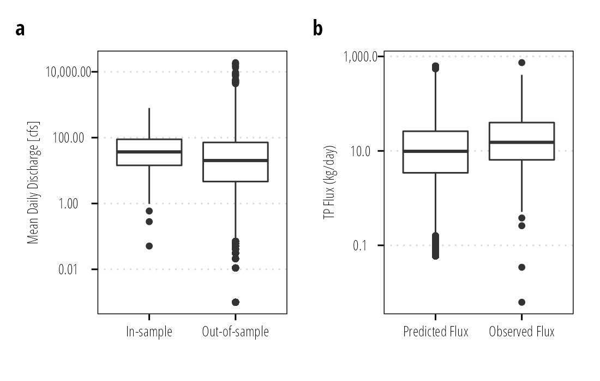
:::
:::

::: {.cell}
::: {.cell-output-display}

:::
:::

\clearpage

## E Mustang Creek nr Louise, USGS-08164504

### NO~3~

::: {.cell}
::: {.cell-output-display}
\begin{widestuff}

\caption{\label{tab:tbl-no3_08164504}NO\textsubscript{3}-N GAM summary - E Mustang Creek nr Louise, USGS-08164504.}
\centering
\begin{tabular}[t]{llllllrll}
\toprule
Component & Term & Estimate & Std.Error & t-value & edf & ref.df & F-value & p-value\textsuperscript{1}\\
\midrule
A. parametric coefficients & (Intercept) & -0.481 & 0.159 & -3.029 &  &  &  & 0.004 **\\
\cmidrule{1-9}
 & s(ddate) &  &  &  & 0.000 & 17 & 0.000 & 0.788\\

 & s(yday) &  &  &  & 2.557 & 4 & 6.592 & 0.000 ***\\

 & s(log1p(Flow)) &  &  &  & 2.793 & 4 & 3.688 & 0.001 **\\

 & s(ma) &  &  &  & 0.000 & 5 & 0.000 & 0.684\\

\multirow[t]{-5}{*}{\raggedright\arraybackslash B. smooth terms} & s(stfa) &  &  &  & 0.003 & 4 & 0.000 & 0.529\\
\bottomrule
\multicolumn{9}{l}{\textsuperscript{1} Signif. codes: 0 <= '***' < 0.001 < '**' < 0.01 < '*' < 0.05 < '+' < 0.1}\\
\multicolumn{9}{l}{\textsuperscript{} Adjusted R-squared: 0.348, Deviance explained 0.498}\\
\multicolumn{9}{l}{\textsuperscript{} -REML : 43.671, Scale est: 1.541, N: 61}\\
\end{tabular}
\end{widestuff}
:::
:::

::: {#tbl-NO308164504-CV .cell tbl-cap='Summary of goodness-of-fit metrics for 5-fold cross-validation of NO~3~-N load GAM at E Mustang Creek nr Louise, USGS-08164504.'}
::: {.cell-output-display}
|**Goodness of Fit Metric** | **Median (IQR)**  |
|:--------------------------|:-----------------:|
|NSE                        | 0.37 (0.26, 0.41) |
|R^2^                       | 0.54 (0.48, 0.57) |
|Percent Bias               |  -47 (-54, -44)   |
:::
:::

\clearpage

::: {.cell}
::: {.cell-output-display}
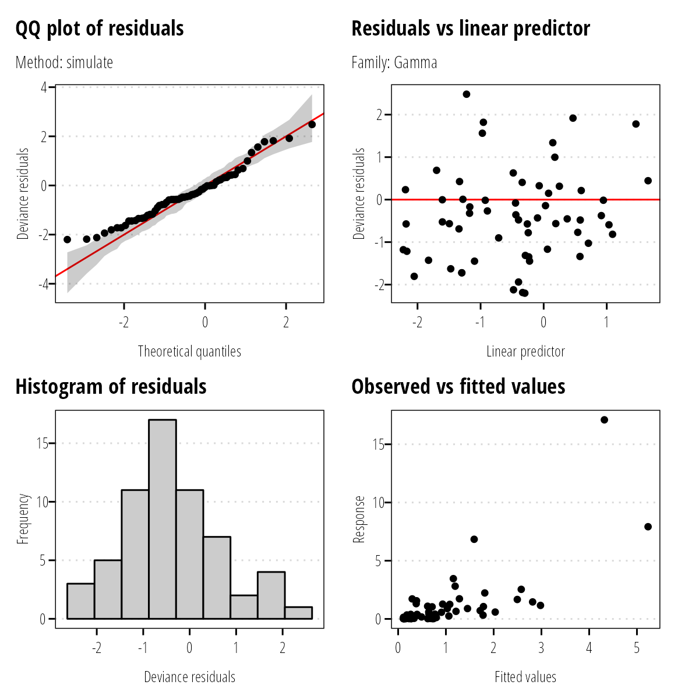
:::
:::

::: {.cell}
::: {.cell-output-display}
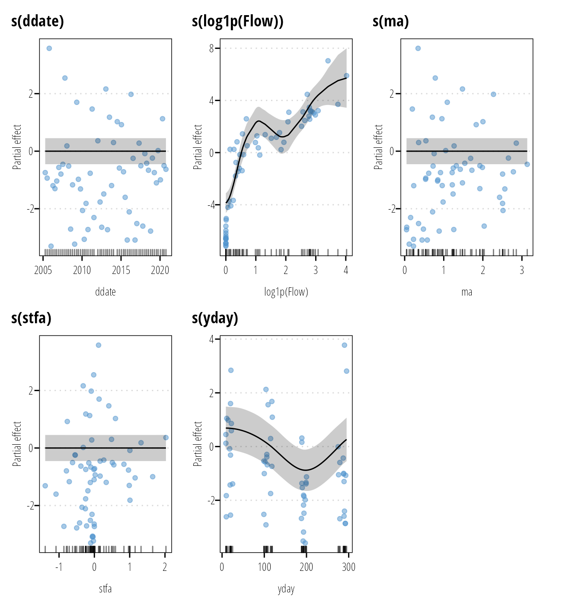
:::
:::

::: {.cell}
::: {.cell-output-display}
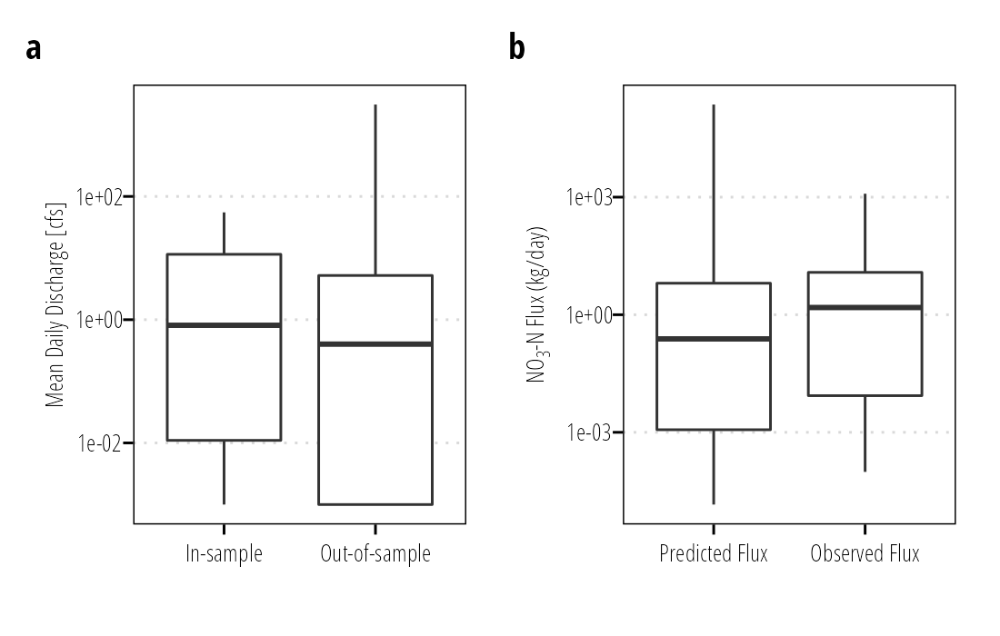
:::
:::

::: {.cell}
::: {.cell-output-display}
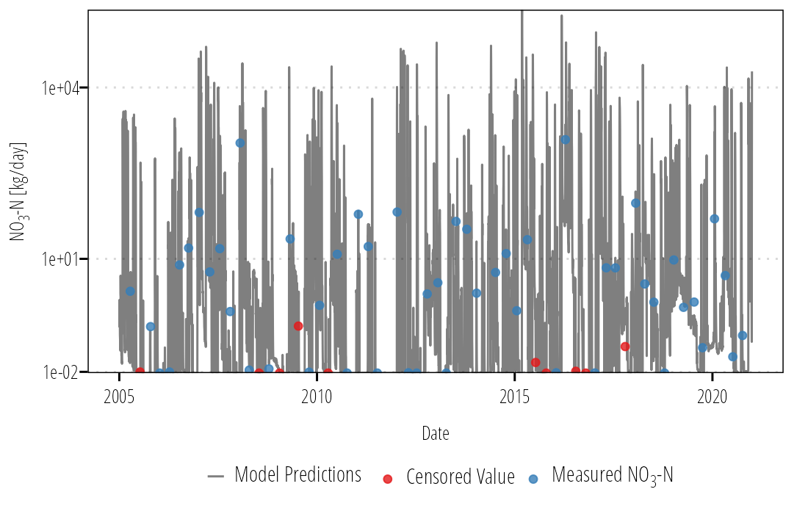
:::
:::

\clearpage

### TP

::: {.cell}
::: {.cell-output-display}
\begin{widestuff}

\caption{\label{tab:tbl-tp_08164504}TP GAM summary - E Mustang Creek nr Louise, USGS-08164504.}
\centering
\begin{tabular}[t]{llllllrll}
\toprule
Component & Term & Estimate & Std.Error & t-value & edf & ref.df & F-value & p-value\textsuperscript{1}\\
\midrule
A. parametric coefficients & (Intercept) & -1.001 & 0.081 & -12.331 &  &  &  & 0.000 ***\\
\cmidrule{1-9}
 & s(ddate) &  &  &  & 0.044 & 17 & 0.003 & 0.343\\

 & s(yday) &  &  &  & 0.385 & 8 & 0.057 & 0.293\\

 & s(log1p(Flow)) &  &  &  & 1.642 & 4 & 1.416 & 0.005 **\\

 & s(ma) &  &  &  & 1.184 & 5 & 0.447 & 0.086 +\\

\multirow[t]{-5}{*}{\raggedright\arraybackslash B. smooth terms} & s(stfa) &  &  &  & 1.015 & 4 & 0.415 & 0.117\\
\bottomrule
\multicolumn{9}{l}{\textsuperscript{1} Signif. codes: 0 <= '***' < 0.001 < '**' < 0.01 < '*' < 0.05 < '+' < 0.1}\\
\multicolumn{9}{l}{\textsuperscript{} Adjusted R-squared: 0.263, Deviance explained 0.246}\\
\multicolumn{9}{l}{\textsuperscript{} -REML : -2.438, Scale est: 0.521, N: 79}\\
\end{tabular}
\end{widestuff}
:::
:::

::: {#tbl-TP08164504-CV .cell tbl-cap='Summary of goodness-of-fit metrics for 5-fold cross-validation of TP load GAM at E Mustang Creek nr Louise, USGS-08164504.'}
::: {.cell-output-display}
|**Goodness of Fit Metric** |   **Median (IQR)**   |
|:--------------------------|:--------------------:|
|NSE                        | 0.851 (0.812, 0.855) |
|R^2^                       | 0.854 (0.839, 0.859) |
|Percent Bias               |  -9.2 (-12.7, -7.5)  |
:::
:::

\clearpage

::: {.cell}
::: {.cell-output-display}
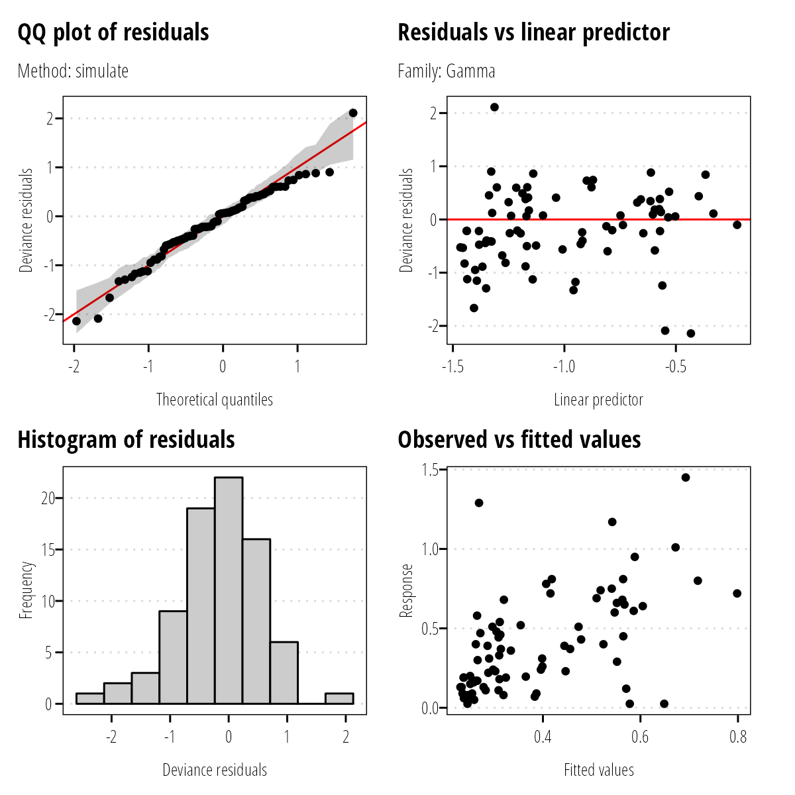
:::
:::

::: {.cell}
::: {.cell-output-display}
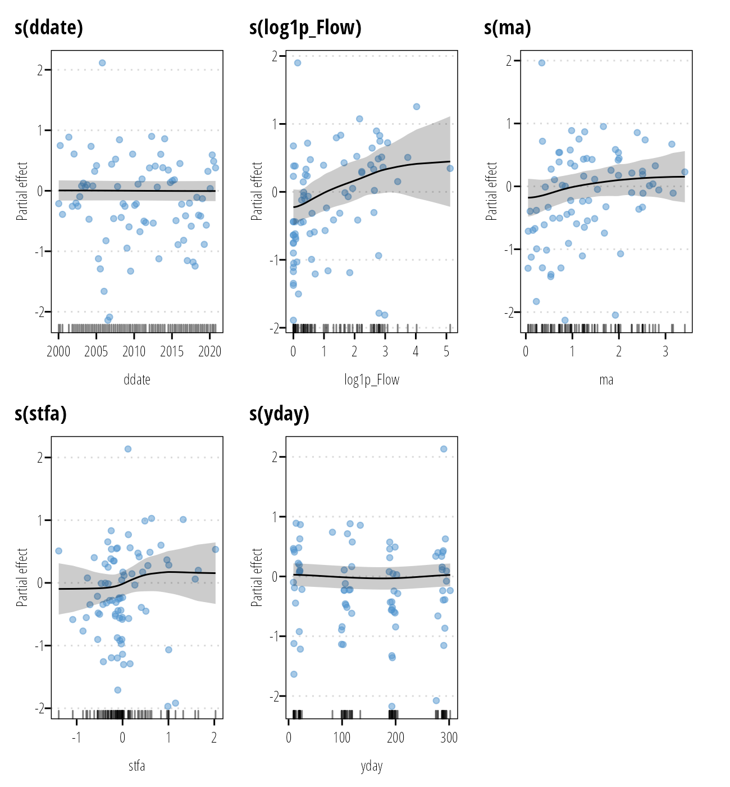
:::
:::

::: {.cell}
::: {.cell-output-display}
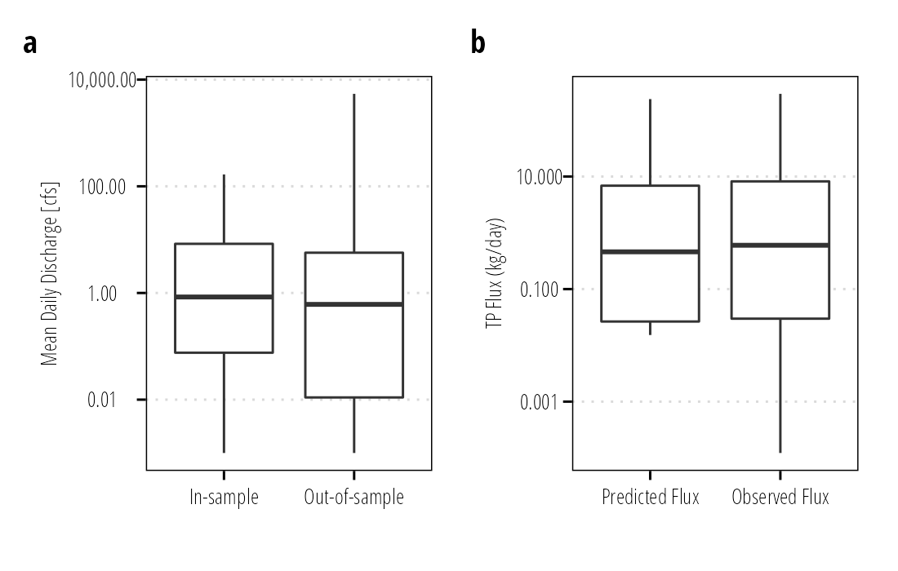
:::
:::

::: {.cell}
::: {.cell-output-display}

:::
:::

\clearpage

## W Mustang Creek nr Ganado, USGS-08164503

### NO~3~

::: {.cell}
::: {.cell-output-display}
\begin{widestuff}

\caption{\label{tab:tbl-no3_08164503}NO\textsubscript{3}-N GAM summary - W Mustang Creek nr Ganado, USGS-08164503.}
\centering
\begin{tabular}[t]{llllllrll}
\toprule
Component & Term & Estimate & Std.Error & t-value & edf & ref.df & F-value & p-value\textsuperscript{1}\\
\midrule
A. parametric coefficients & (Intercept) & -1.217 & 0.085 & -14.372 &  &  &  & 0.000 ***\\
\cmidrule{1-9}
 & s(ddate) &  &  &  & 1.161 & 17 & 0.210 & 0.048 *\\

 & s(yday) &  &  &  & 2.554 & 4 & 8.892 & 0.000 ***\\

 & s(log1p(Flow)) &  &  &  & 5.355 & 6 & 7.166 & 0.000 ***\\

 & s(ma) &  &  &  & 0.855 & 5 & 0.267 & 0.151\\

\multirow[t]{-5}{*}{\raggedright\arraybackslash B. smooth terms} & s(stfa) &  &  &  & 1.272 & 5 & 0.352 & 0.199\\
\bottomrule
\multicolumn{9}{l}{\textsuperscript{1} Signif. codes: 0 <= '***' < 0.001 < '**' < 0.01 < '*' < 0.05 < '+' < 0.1}\\
\multicolumn{9}{l}{\textsuperscript{} Adjusted R-squared: 0.566, Deviance explained 0.632}\\
\multicolumn{9}{l}{\textsuperscript{} -REML : -2.104, Scale est: 0.452, N: 63}\\
\end{tabular}
\end{widestuff}
:::
:::

::: {#tbl-NO08164503-CV .cell tbl-cap='Summary of goodness-of-fit metrics for 5-fold cross-validation of NO~3~-N load GAM at W Mustang Creek nr Ganado, USGS-08164503.'}
::: {.cell-output-display}
|**Goodness of Fit Metric** | **Median (IQR)**  |
|:--------------------------|:-----------------:|
|NSE                        | 0.51 (0.32, 0.69) |
|R^2^                       | 0.55 (0.44, 0.70) |
|Percent Bias               |  -17 (-22, -11)   |
:::
:::

\clearpage

::: {.cell}
::: {.cell-output-display}
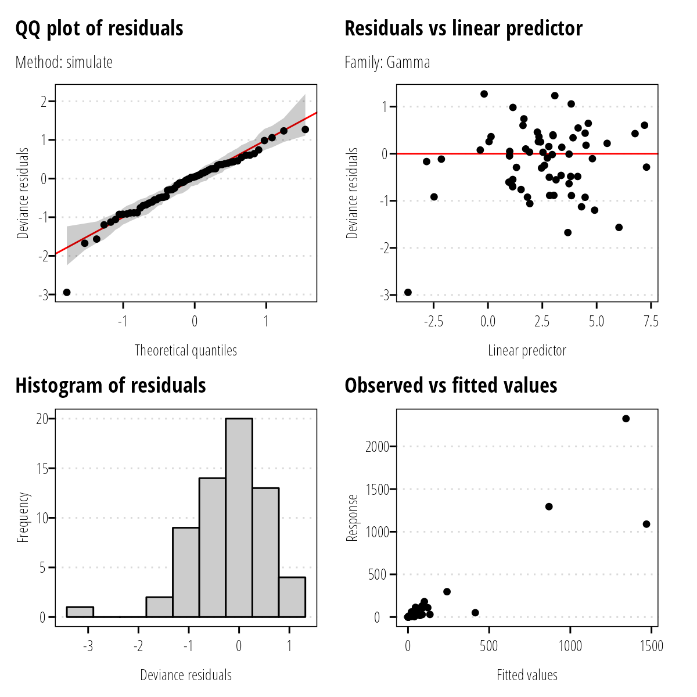
:::
:::

::: {.cell}
::: {.cell-output-display}
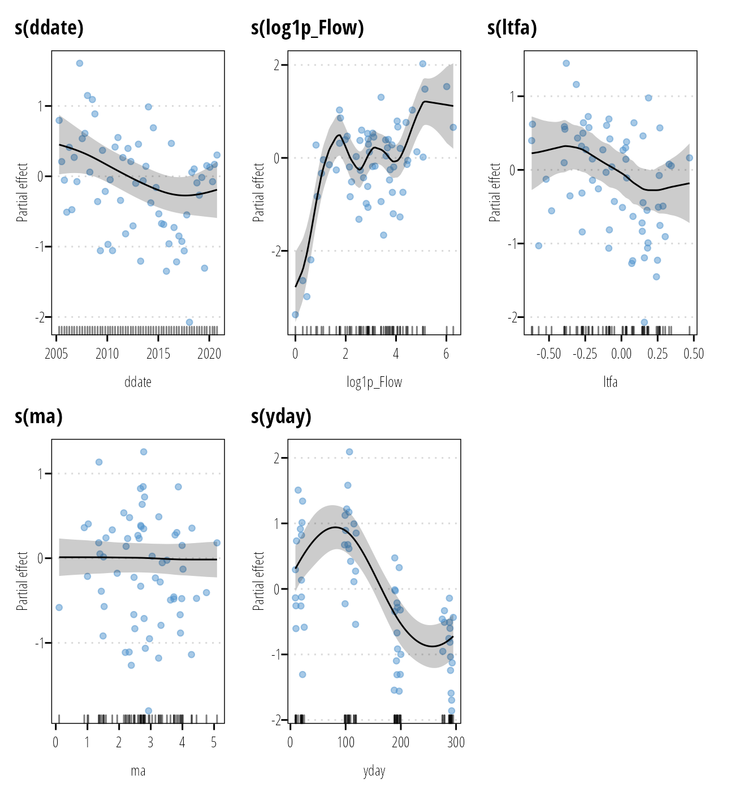
:::
:::

::: {.cell}
::: {.cell-output-display}
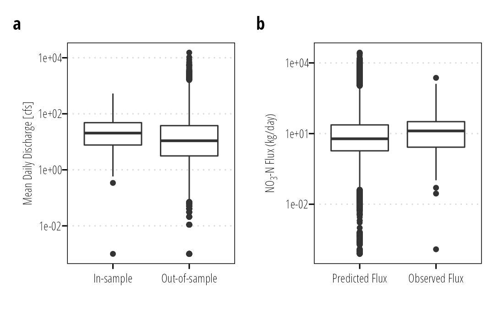
:::
:::

::: {.cell}
::: {.cell-output-display}
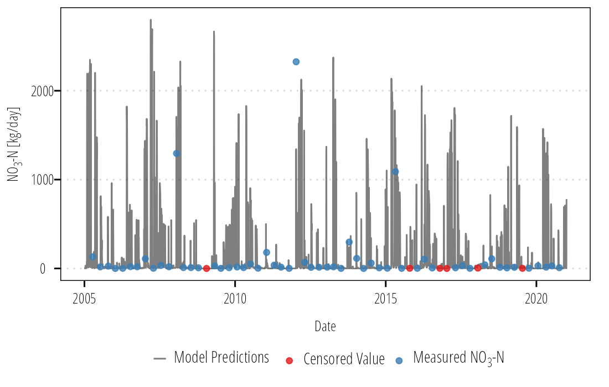
:::
:::

\clearpage

### TP

::: {.cell}
::: {.cell-output-display}
\begin{widestuff}

\caption{\label{tab:tbl-tp_08164503}TP GAM summary - W Mustang Creek nr Ganado, USGS-08164503.}
\centering
\begin{tabular}[t]{llllllrll}
\toprule
Component & Term & Estimate & Std.Error & t-value & edf & ref.df & F-value & p-value\textsuperscript{1}\\
\midrule
A. parametric coefficients & (Intercept) & -1.150 & 0.063 & -18.148 &  &  &  & 0.000 ***\\
\cmidrule{1-9}
 & s(ddate) &  &  &  & 2.054 & 17 & 0.411 & 0.025 *\\

 & s(yday) &  &  &  & 0.000 & 4 & 0.000 & 0.573\\

 & s(log1p(Flow)) &  &  &  & 0.000 & 9 & 0.000 & 0.648\\

 & s(stfa) &  &  &  & 0.235 & 5 & 0.050 & 0.342\\

\multirow[t]{-5}{*}{\raggedright\arraybackslash B. smooth terms} & s(ma) &  &  &  & 0.285 & 5 & 0.067 & 0.293\\
\bottomrule
\multicolumn{9}{l}{\textsuperscript{1} Signif. codes: 0 <= '***' < 0.001 < '**' < 0.01 < '*' < 0.05 < '+' < 0.1}\\
\multicolumn{9}{l}{\textsuperscript{} Adjusted R-squared: 0.0843, Deviance explained 0.142}\\
\multicolumn{9}{l}{\textsuperscript{} -REML : -33.755, Scale est: 0.325, N: 81}\\
\end{tabular}
\end{widestuff}
:::
:::

::: {#tbl-TP08164503-CV .cell tbl-cap='Summary of goodness-of-fit metrics for 5-fold cross-validation of TP load GAM at W Mustang Creek nr Ganado, USGS-08164503.'}
::: {.cell-output-display}
|**Goodness of Fit Metric** |   **Median (IQR)**   |
|:--------------------------|:--------------------:|
|NSE                        | 0.864 (0.838, 0.882) |
|R^2^                       | 0.890 (0.887, 0.896) |
|Percent Bias               | -6.50 (-9.12, -4.70) |
:::
:::

\clearpage

::: {.cell}
::: {.cell-output-display}
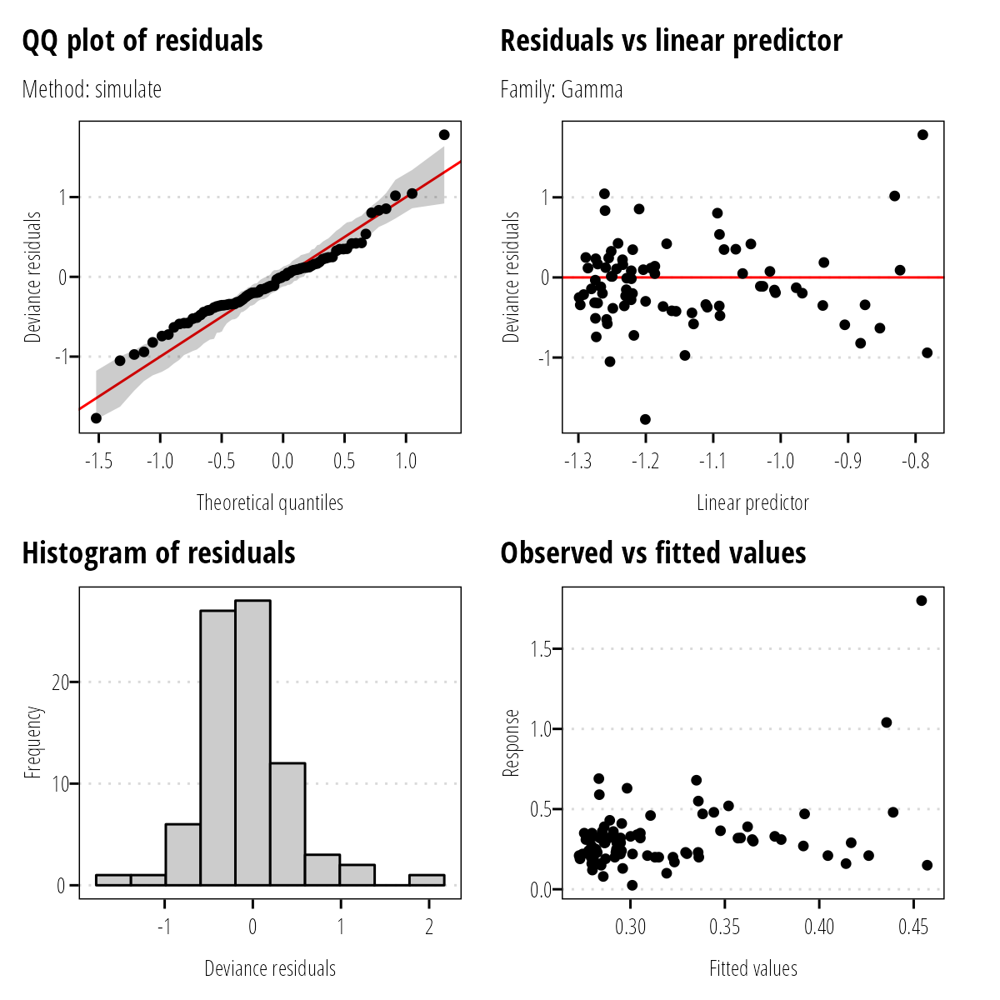
:::
:::

::: {.cell}
::: {.cell-output-display}
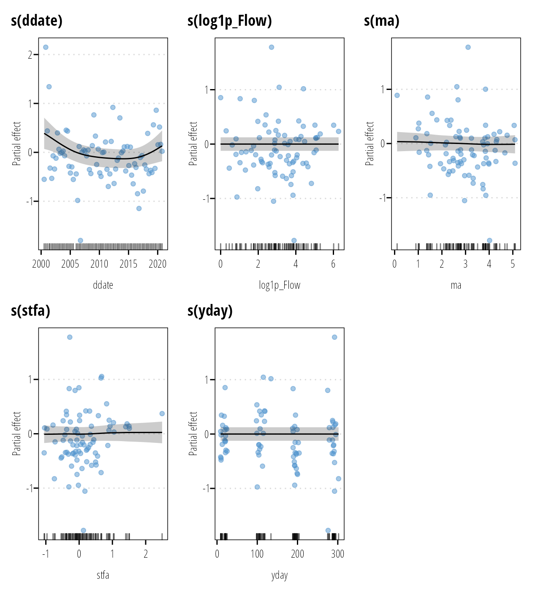
:::
:::

::: {.cell}
::: {.cell-output-display}
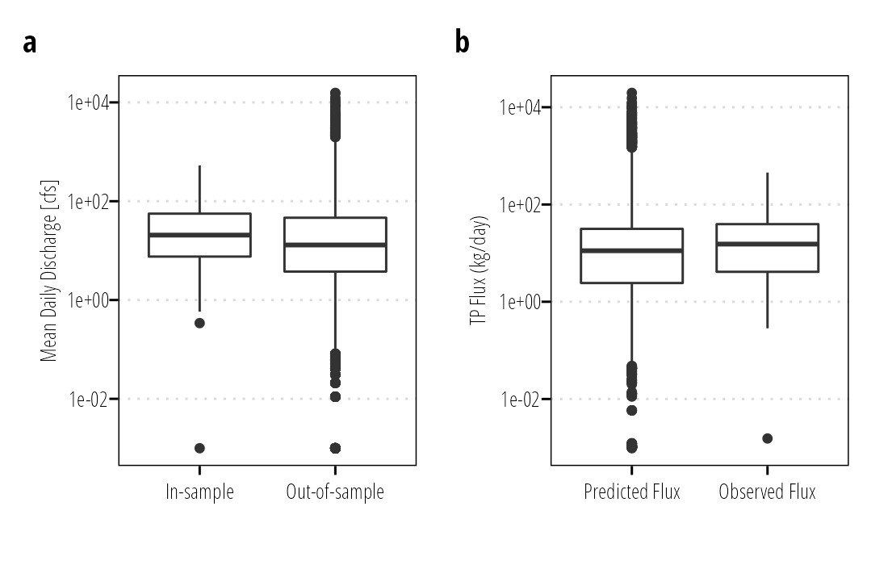
:::
:::

::: {.cell}
::: {.cell-output-display}
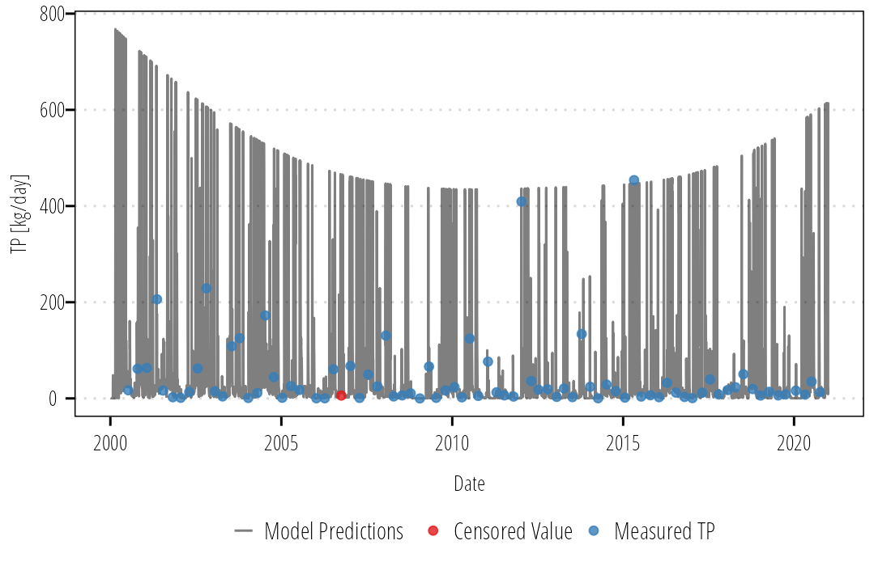
:::
:::

\clearpage

## Palmetto Bend Dam

### NO~3~

::: {.cell}
::: {.cell-output-display}
\begin{widestuff}

\caption{\label{tab:tbl-no3_texana}NO\textsubscript{3}-N GAM summary - Navidad River at Palmetto Bend Dam.}
\centering
\begin{tabular}[t]{llllllrll}
\toprule
Component & Term & Estimate & Std.Error & t-value & edf & ref.df & F-value & p-value\textsuperscript{1}\\
\midrule
A. parametric coefficients & (Intercept) & -1.384 & 0.113 & -12.212 &  &  &  & 0.000 ***\\
\cmidrule{1-9}
 & s(ddate) &  &  &  & 0.000 & 9 & 0.000 & 0.601\\

 & s(yday) &  &  &  & 2.523 & 8 & 3.871 & 0.000 ***\\

 & s(log1p(Inflow)) &  &  &  & 0.000 & 4 & 0.000 & 0.714\\

 & s(log1p(Flow)) &  &  &  & 0.000 & 9 & 0.000 & 0.510\\

 & s(stfa) &  &  &  & 0.002 & 4 & 0.000 & 0.431\\

\multirow[t]{-6}{*}{\raggedright\arraybackslash B. smooth terms} & s(ma) &  &  &  & 2.884 & 5 & 2.769 & 0.002 **\\
\bottomrule
\multicolumn{9}{l}{\textsuperscript{1} Signif. codes: 0 <= '***' < 0.001 < '**' < 0.01 < '*' < 0.05 < '+' < 0.1}\\
\multicolumn{9}{l}{\textsuperscript{} Adjusted R-squared: 0.466, Deviance explained 0.513}\\
\multicolumn{9}{l}{\textsuperscript{} -REML : -8.419, Scale est: 0.0355, N: 62}\\
\end{tabular}
\end{widestuff}
:::
:::

::: {#tbl-NO3PalmettoBend-CV .cell tbl-cap='Summary of goodness-of-fit metrics for 5-fold cross-validation of NO~3~-N load GAM at Palmetto Bend Dam.'}
::: {.cell-output-display}
|**Goodness of Fit Metric** | **Median (IQR)**  |
|:--------------------------|:-----------------:|
|NSE                        | 0.47 (0.33, 0.59) |
|R^2^                       | 0.77 (0.66, 0.90) |
|Percent Bias               |  -45 (-55, -38)   |
:::
:::

\clearpage

::: {.cell}
::: {.cell-output-display}
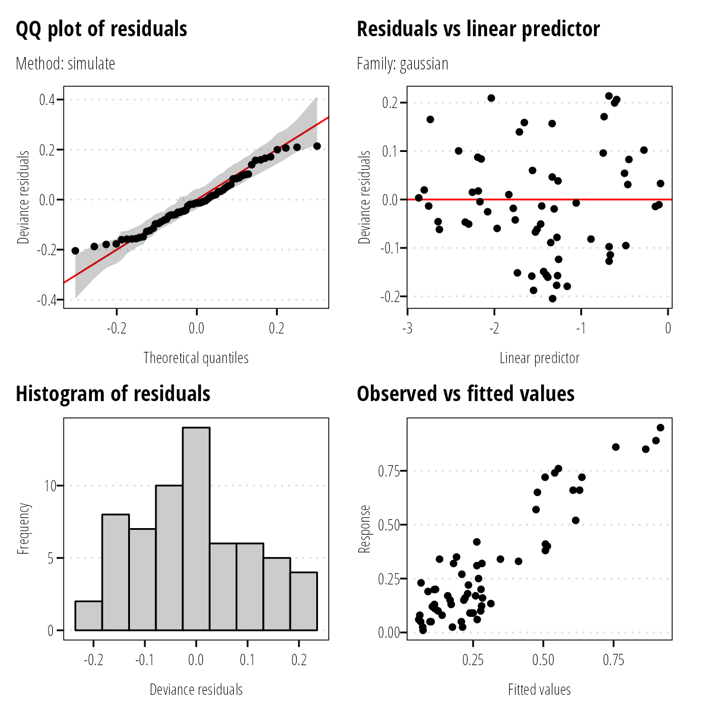
:::
:::

::: {.cell}
::: {.cell-output-display}
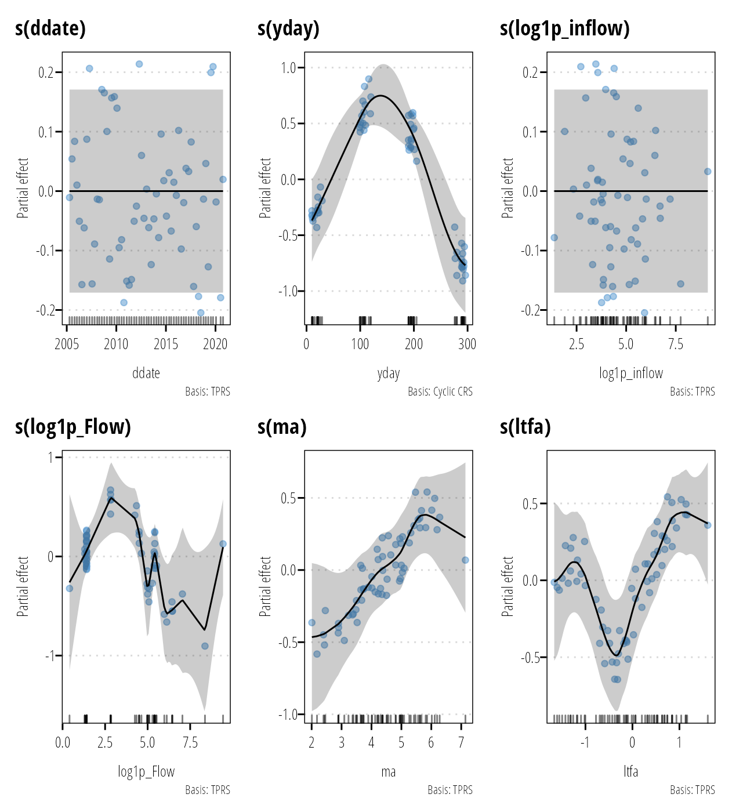
:::
:::

::: {.cell}
::: {.cell-output-display}
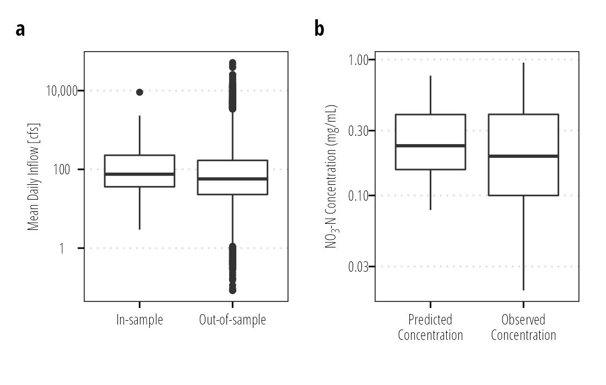
:::
:::

::: {.cell}
::: {.cell-output-display}
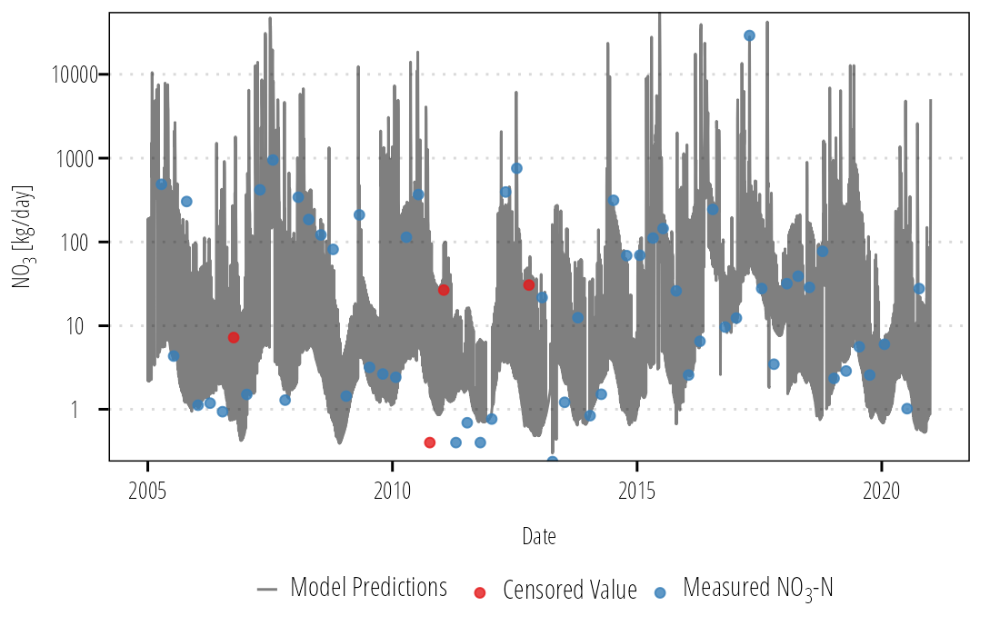
:::
:::

\clearpage

### TP

::: {.cell}
::: {.cell-output-display}
\begin{widestuff}

\caption{\label{tab:tbl-tp_texana}TP GAM summary - Navidad River at Palmetto Bend Dam.}
\centering
\begin{tabular}[t]{llllllrll}
\toprule
Component & Term & Estimate & Std.Error & t-value & edf & ref.df & F-value & p-value\textsuperscript{1}\\
\midrule
A. parametric coefficients & (Intercept) & -1.624 & 0.037 & -44.377 &  &  &  & 0.000 ***\\
\cmidrule{1-9}
 & s(ddate) &  &  &  & 3.214 & 8 & 1.862 & 0.001 ***\\

 & s(yday) &  &  &  & 1.309 & 8 & 0.374 & 0.088 +\\

 & s(log1p(Inflow)) &  &  &  & 0.003 & 9 & 0.000 & 0.360\\

 & s(log1p(Flow)) &  &  &  & 1.104 & 4 & 0.561 & 0.098 +\\

 & s(stfa) &  &  &  & 0.000 & 5 & 0.000 & 0.470\\

\multirow[t]{-6}{*}{\raggedright\arraybackslash B. smooth terms} & s(ma) &  &  &  & 2.262 & 5 & 1.669 & 0.006 **\\
\bottomrule
\multicolumn{9}{l}{\textsuperscript{1} Signif. codes: 0 <= '***' < 0.001 < '**' < 0.01 < '*' < 0.05 < '+' < 0.1}\\
\multicolumn{9}{l}{\textsuperscript{} Adjusted R-squared: 0.321, Deviance explained 0.388}\\
\multicolumn{9}{l}{\textsuperscript{} -REML : -99.963, Scale est: 0.00403, N: 81}\\
\end{tabular}
\end{widestuff}
:::
:::

::: {#tbl-TPPalmettoBend-CV .cell tbl-cap='Summary of goodness-of-fit metrics for 5-fold cross-validation of TP GAM at Palmetto Bend Dam.'}
::: {.cell-output-display}
|**Goodness of Fit Metric** |   **Median (IQR)**   |
|:--------------------------|:--------------------:|
|NSE                        | 0.877 (0.862, 0.911) |
|R^2^                       | 0.961 (0.956, 0.975) |
|Percent Bias               | -17.6 (-21.1, -12.7) |
:::
:::

\clearpage

::: {.cell}
::: {.cell-output-display}
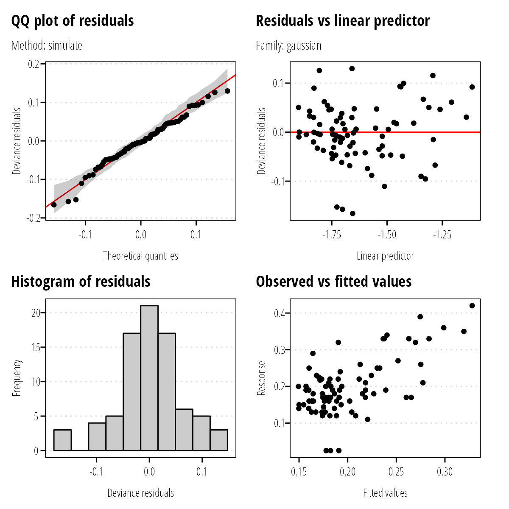
:::
:::

::: {.cell}
::: {.cell-output-display}
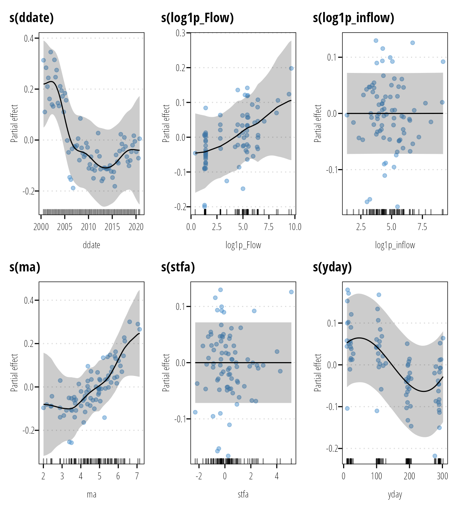
:::
:::

::: {.cell}
::: {.cell-output-display}
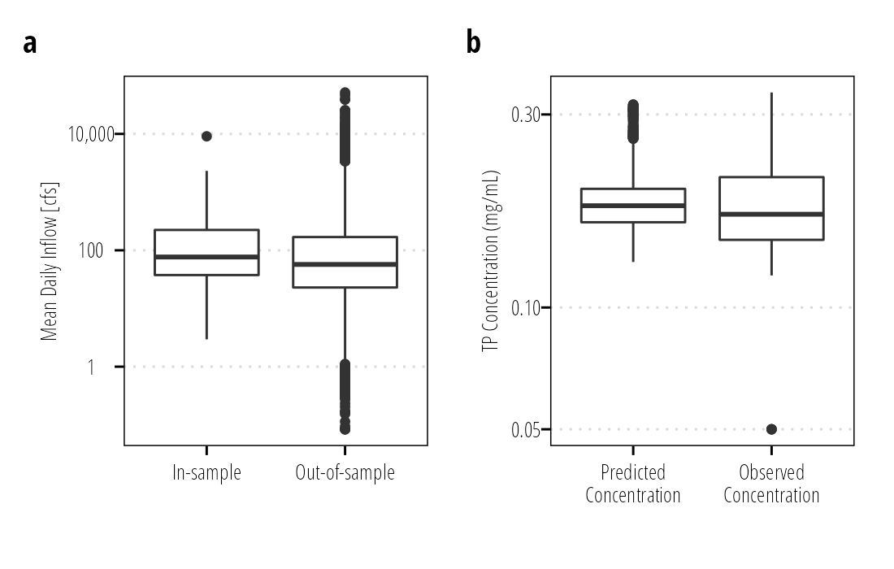
:::
:::

::: {.cell}
::: {.cell-output-display}
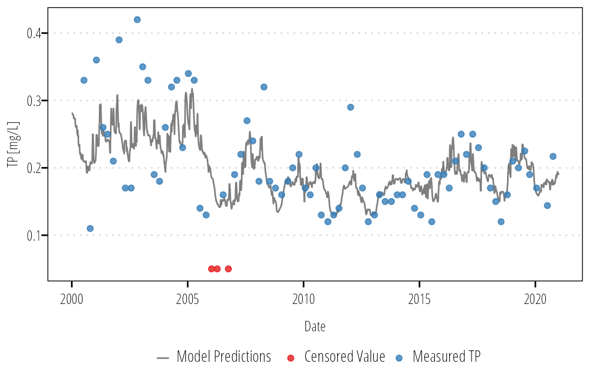
:::
:::

\clearpage

## References